# **Lab 0: Setting up the lab environment**

## **Exercise 1: Assign Power Apps trial license**

1.  Open a web browser on your VM and go
    to !!https://powerapps.microsoft.com/en-us/free/!!.

     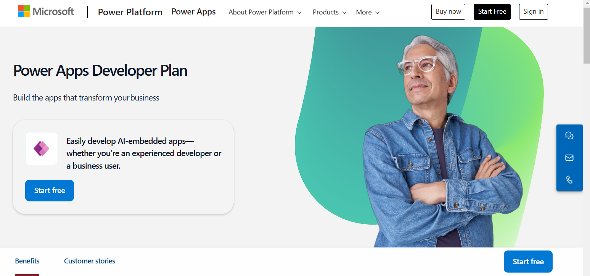

2.  Select **Start free**.

     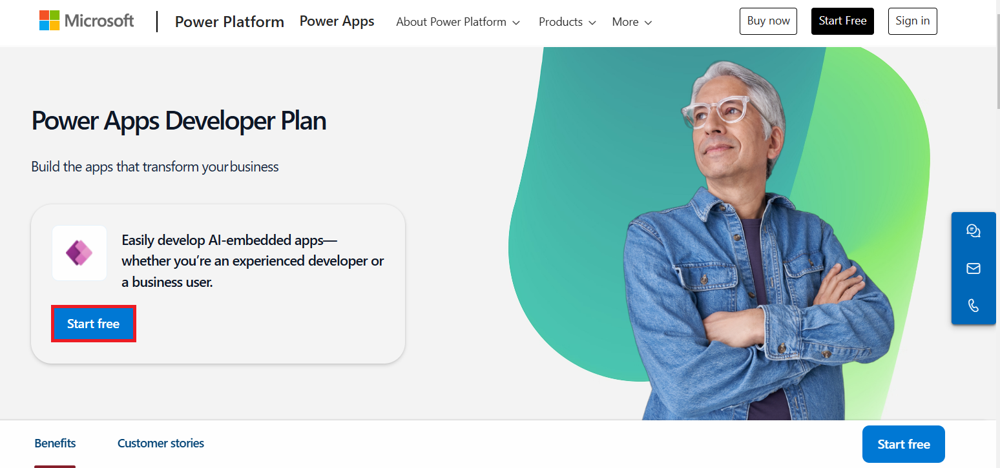

3.  Enter your Office 365 admin credential, check the checkbox to accept
    the agreement and click on **Start your free trial**.

     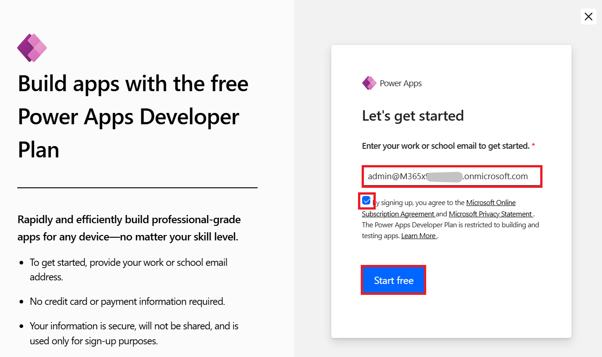

     **Note:** Check that you have entered admin credential correctly.
     While pasting, you may miss some characters then you need to enter them manually.

4.  Enter the password of your given admin tenant.

     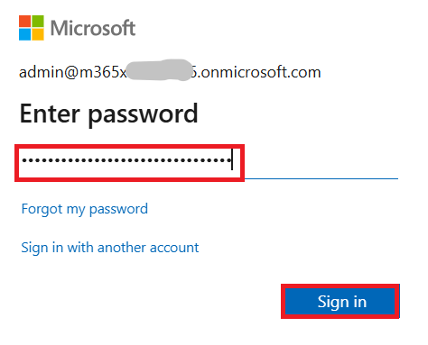

5.  Select **Yes** on **Stay signed-in** window.

     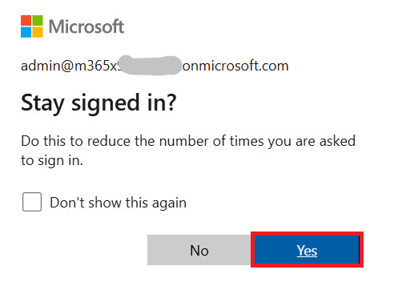

6.  You can now see **Home page of Power Apps** and the developer
    environment - **Dev One** is created for you.

     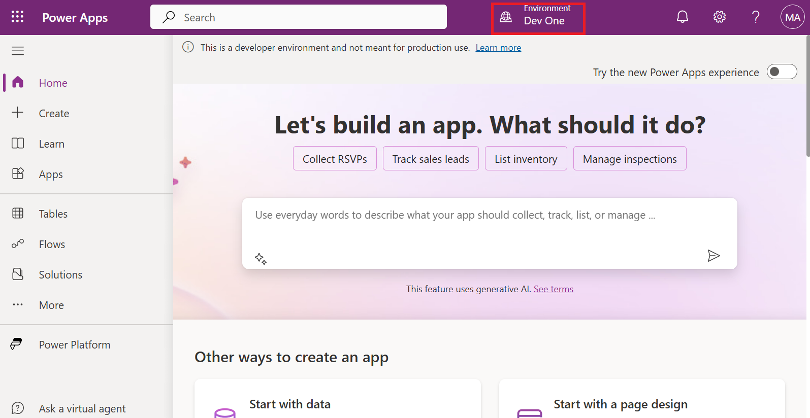

7.  Open the new tab and go to Power Platform admin center by navigating
    to !!https://admin.powerplatform.microsoft.com!! and
    if required, sign in using your given Office 365 tenant admin
    credentials. If the **Pop-up window** appears saying, ‘Welcome to
    the Power Platform admin center’, **close** it.

     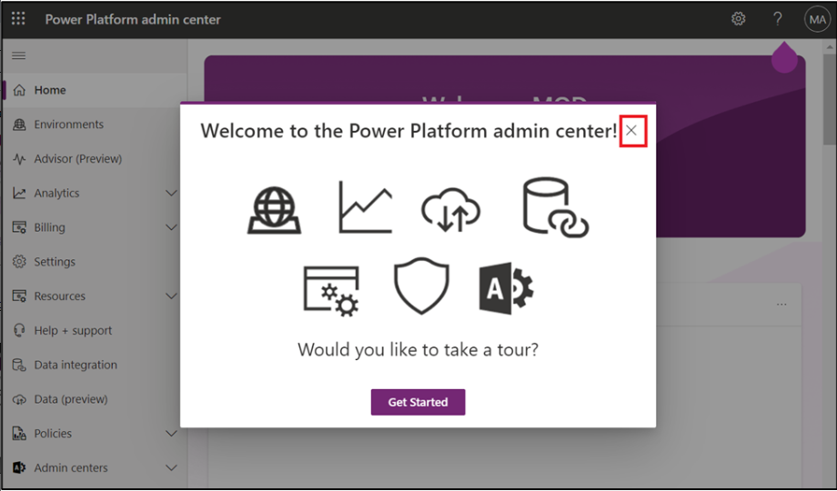

8.  From the left navigation pane, select **Environments** and then you
    can see, **Dev One** is your Dataverse environment.

     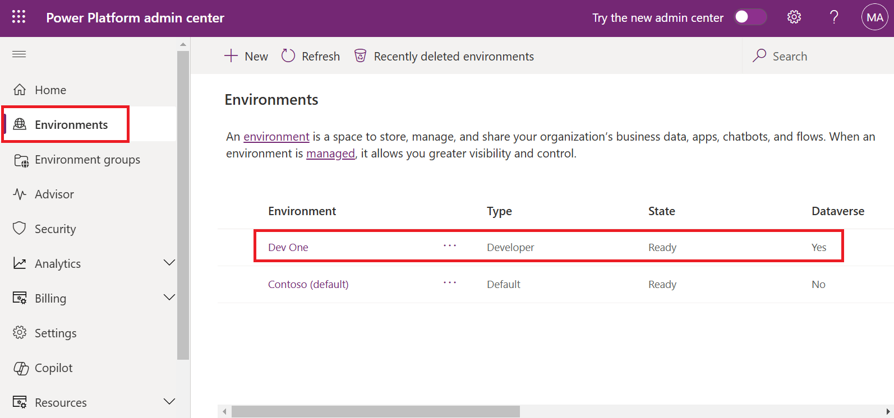

9.  You can now proceed to the next exercise.

## **Exercise 2: Create a team in Microsoft Teams **

1.  Sign into the Microsoft Teams
    using !!https://teams.microsoft.com/!! with
    your Office 365 tenant credentials.

2.  On Welcome to Teams window, select **Get Started**.

     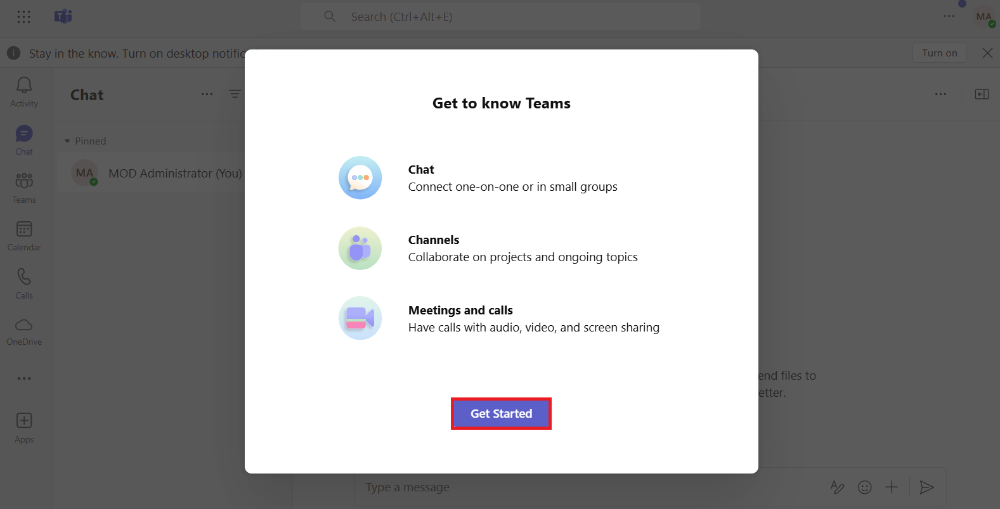

3.  Close the window which asks for scanning QR code.

     

4.  On the left side of Teams, click **Teams**, click **+** to **Join or
    create a team**.

     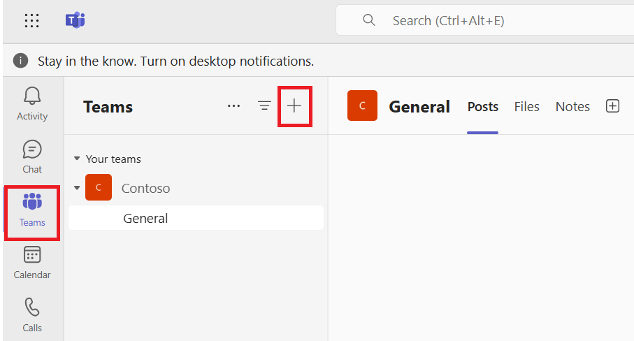

5.  Click on **Create team**.

     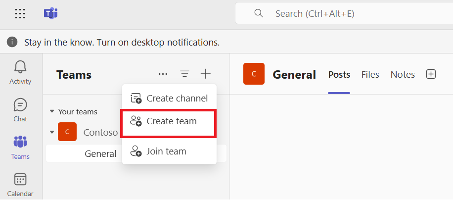

6.  Enter the Team name – !!**Test Team**!!,
    name the first channel as !!**TestChannel**!! and Click on **Private**.

     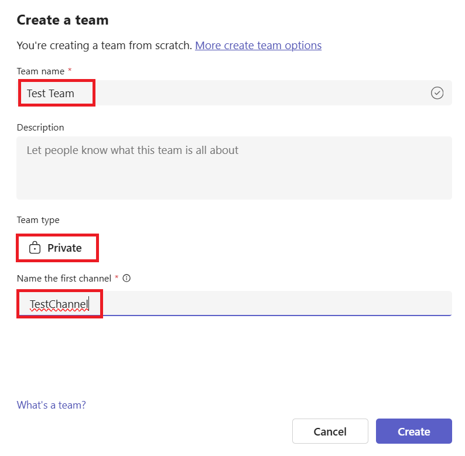

7.  Select **Org-wide**.

    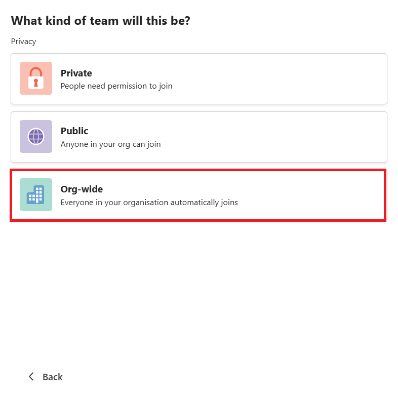

8.  You will be navigated back to **Create a team** screen.
    Select **Create**.

    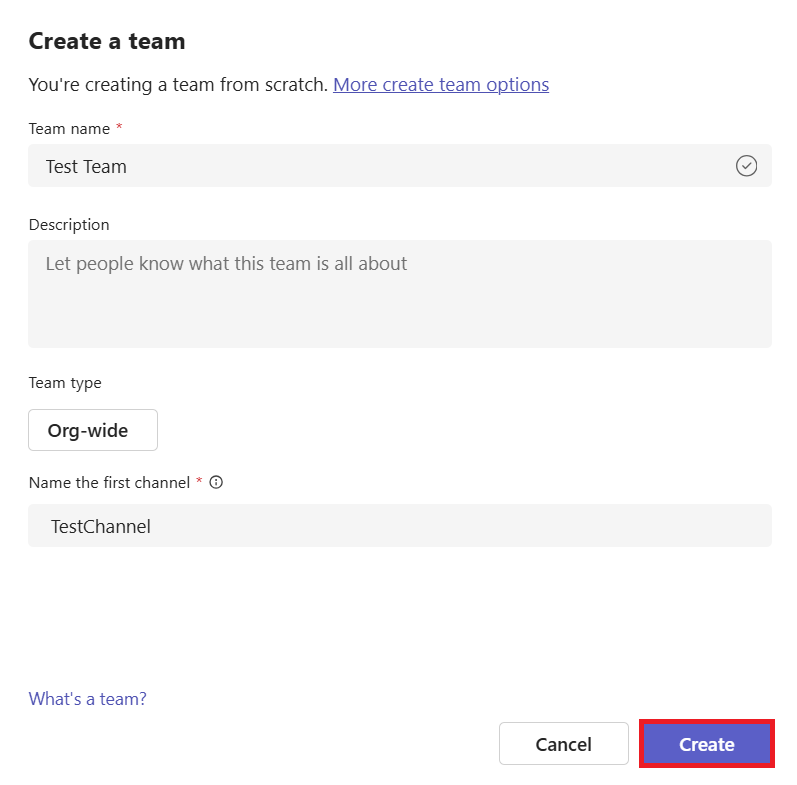

9.  You can view the channel in teams when added.

     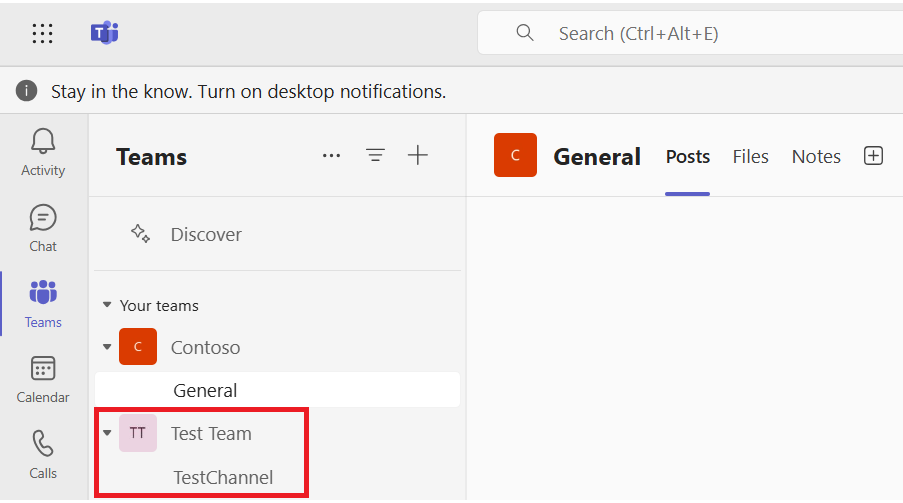
