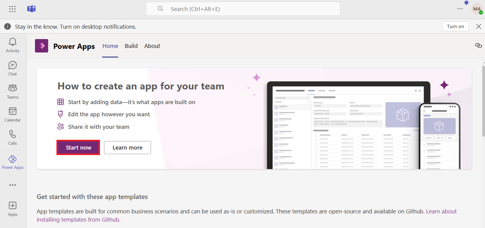
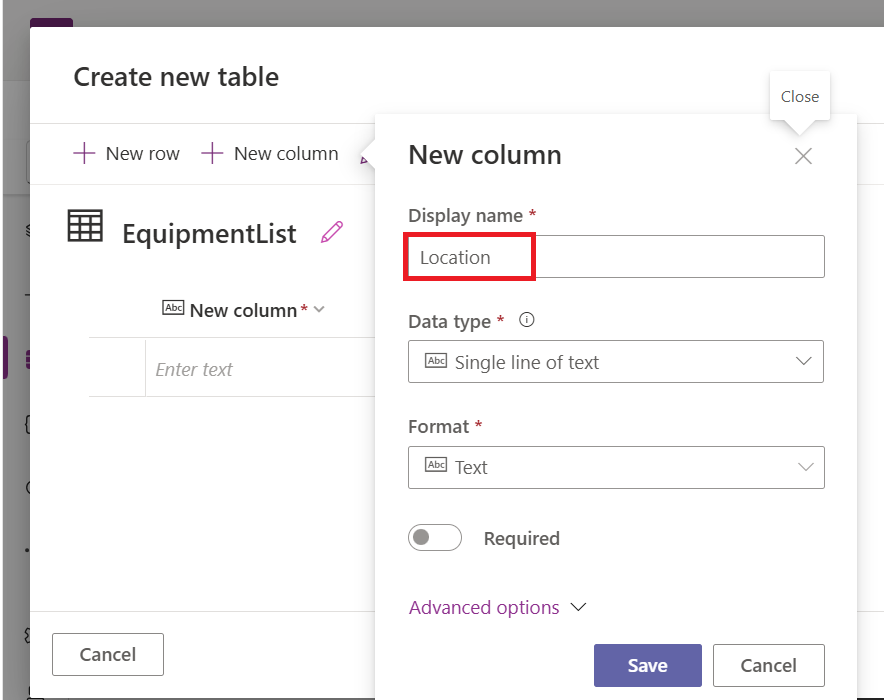
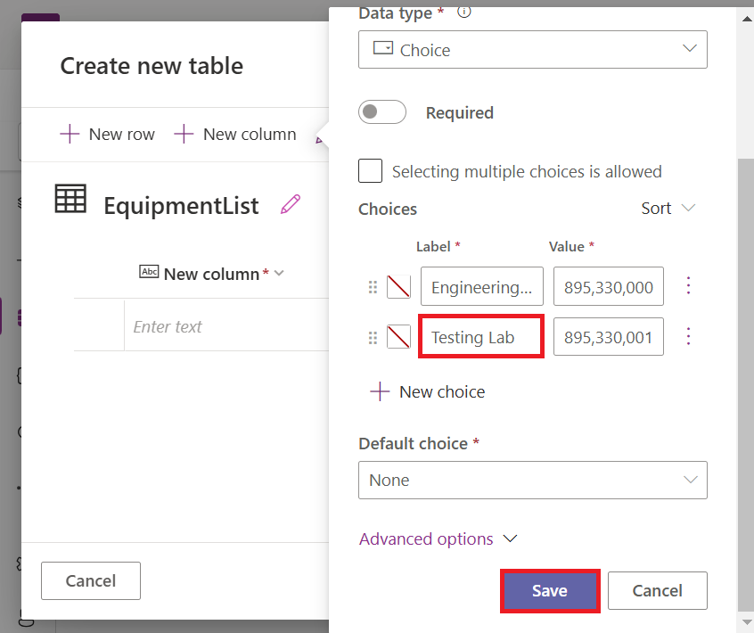
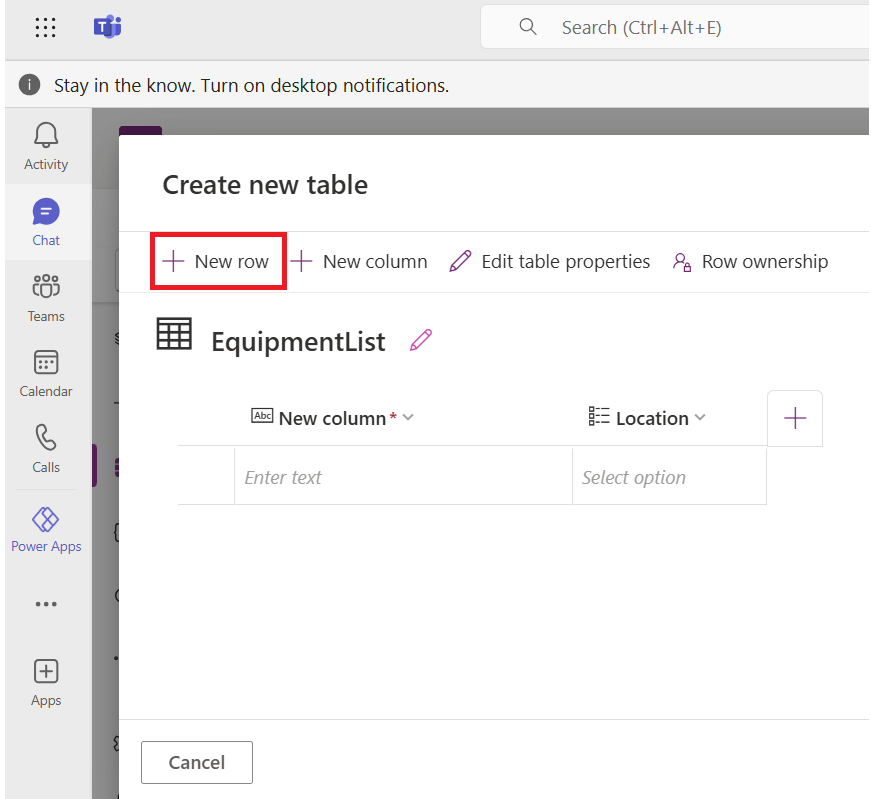
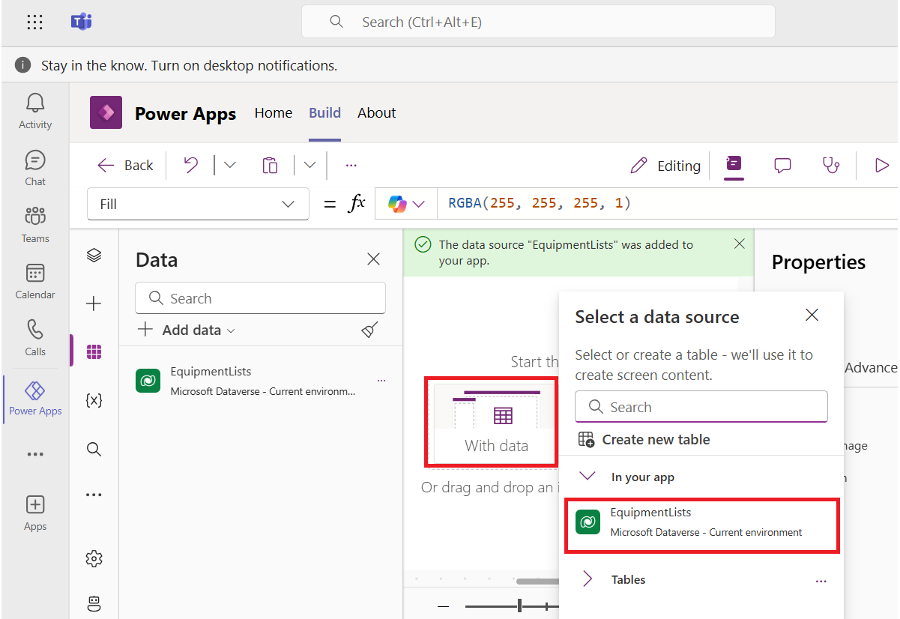
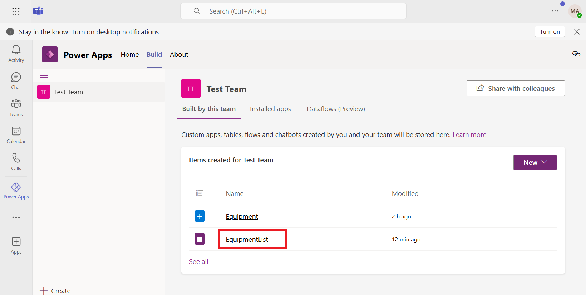

# **Lab 1: Create your first canvas app in Microsoft Teams**

The Dataverse for Teams environment is where all business data, apps,
and flows are stored. When an app or chatbot is created or installed for
the first time into a team, the Dataverse for Teams environment is
provisioned automatically. After the environment has been created, you
can create tables and flows in Dataverse

## **Exercise 1: Install Power Apps inside Teams**

The Power Apps application for Teams lets you create, edit, and delete
apps and tables in Dataverse for Teams. To provide the Dataverse for
Teams environment, you first need to install an app into Teams.

1.  Open Microsoft Teams, and then select **More added apps** (...).

> 

2.  Search for **Power Apps**.

> 

3.  Select the **Add** button to add the Power Apps application to your
    Teams client.

> 

4.  Pop-up will appear on the screen. You can browse through the tips
    shared or can **Skip** the screen.

> 

5.  When Teams has successfully added Power Apps, you will be brought to
    the main **Power Apps** screen. This screen provides access to
    existing apps along with templates, videos, and other resources for
    building apps. You can access the app in Teams from the left pane.

## **Exercise 2: Provision Dataverse for Teams to create a table**

### **Task 1: Create an app in Teams**

1.  Now that you have the Power Apps application installed, you can
    create the first app, which will automatically provision the
    environment

2.  Select the **Start now** button.

> 

3.  On **Create an app**, select the **Test Team** team for your app. A
    message will appear, stating that you are the first person to create
    an app in this team.

> 

4.  Select **Create** to have the Dataverse for Teams environment built.
    You'll see confirmation about the Dataverse for Teams environment
    being created, which might take some time.

> 
>
> 

5.  When your environment is provisioned, a pop-up window will display
    in the lower-right corner of your screen, letting you know that the
    process has finished.

> 

6.  At this stage, the Power Apps editor will appear. Enter the
    name **Equipment** for your app and then select **Save**.

> 

With the creation of the first app, you now have a Dataverse for Teams
environment to help you start building tables. You can view a
notification in Teams once the app is created. The Power Apps editor
enables you to quickly create tables with the **Create new
table** button, which the next step will explain.

### **Task 2: Create your first table to store data**

1.  While editing an app in the **Power Apps editor** for Teams, Click
    the **Data** icon. Select the **Create new table** button.

> 

2.  On **Create new table** page, click on **Start with a blank table.**

3.  Click on the **pencil icon** located next to **New table** to edit
    the table name.

4.  Enter !!**EquipmentList!!** in the **Display name** column because
    you want the table to hold a list of equipment. Click on **Save** to
    complete the process.

4.  After a few seconds, your table will be provisioned and will display
    in the visual table editor. The visual table editor enables you to
    quickly populate your table with the **+ New column** and **+ New
    row** options.

> 

5.  To exemplify the process of using the visual table editor to
    populate your table, the following steps show how to add
    a **Location** column that will have two choices of **Engineering
    Lab** and **Testing Lab**. Select **+ New column**.

> 

6.  In the **Display** **Name** column,
    enter [**Location**](urn:gd:lg:a:send-vm-keys).

> 

7.  To indicate the type of data that the table will contain,
    select **Choice \> Choice** from the **Data** **Type** drop-down
    menu.

> 

8.  Fill in the **Choices** option with [**Engineering
    Lab**](urn:gd:lg:a:send-vm-keys) under the **Label** field.

> 

9.  Click on **+New choice** and enter [**Testing
    Lab**](urn:gd:lg:a:send-vm-keys), then Select **Save** when
    finished.

> 

10. Select **+ New rows** to fill out your table with data.

> 

11. Continue adding the below two records in the table.

> [**LED Display Unit**](urn:gd:lg:a:send-vm-keys) - **Testing Lab**
>
> [**Digital Whiteboard**](urn:gd:lg:a:send-vm-keys) - **Engineering
> Lab** (To enter Engineering Lab, double click on the location field in
> second row and then select Engineering Lab from dropdown menu)
>
> 

11. After you have finished editing the table, select **Save
    and** **Close** from the bottom of the editor to return to the app.
    Now that you have data for the app, Dataverse for Teams
    automatically generates a basic application.

> 

12. Now that the data is ready. Click on **With data** in the center and
    select the **Data source** and continue to add the
    Data **EquipmentLists** onto the screen.

> 

13. The screen looks like the one shown in the image below.

**Note:** Adjust the resolution of canvas using sliding bar.

> 

14. **Save** the app using save icon located at right corner in Power
    Apps editor.

> 

### **Task 3: Edit the table using Power Apps table editor**

Occasionally, you will want to edit your table and include more data
types that are not in the visual table editor.

1.  To open your table in the full editor, select **Build** and then
    select Test Team and then you can see the items we created for this
    team.

> 

2.  Select **Tables** and then select the ellipsis (**...**) for the
    table.

> 

3.  Selecting **Edit** will bring up the full table editor, or you can
    select **Edit** for the visual table editor experience. For now,
    select **Edit** for the full editor.

> 

3.  First, it might appear as if a mistake has been made because several
    columns that you did not create are displayed. This result is normal
    and an example of the power of Dataverse in action. Click on the
    4more dropdown to view all the columns, select all and click on
    **Save.**

> 
>
> **Note**: The other columns in your table are created by the system.
> Those columns are useful if you need more information about your data.
> For example, the **Created On** column can tell you when a record was
> created, while the **Modified By** column can tell you who last
> touched it.
>
> 

5.  Select the **+ New column** button at the top of the screen.

> 

6.  Add a Column named **Category** and to set its Datatype as **Text**,
    select **arrow** next to **Text** and then under **Single line of
    text**, select **Plain text**.

> 

7.  Click **Save** to save this change.

> 

6.  After you save the changes, you will have the **New column** added
    to your table.

> 

7.  Select **Back** on Power Apps.

> 

8.  Select **Apps**.

> 

9.  Select **More options (…)** Infront of the **Equipment** app and
    then select **Edit**.

> 

10. Select **Save**.

> 

11. Select **Publish to Teams**.

> 

12. Select **Next** on Publish window.

> 

13. Select **+ icon** next to **TestChannel**.

> 

14. Select **Equipment** app and then select **Save and close**.

> 

15. Select **Teams** from left navigation pane, Select **TestChannel**
    and you can see the **Equipment** app is now added.

> 
