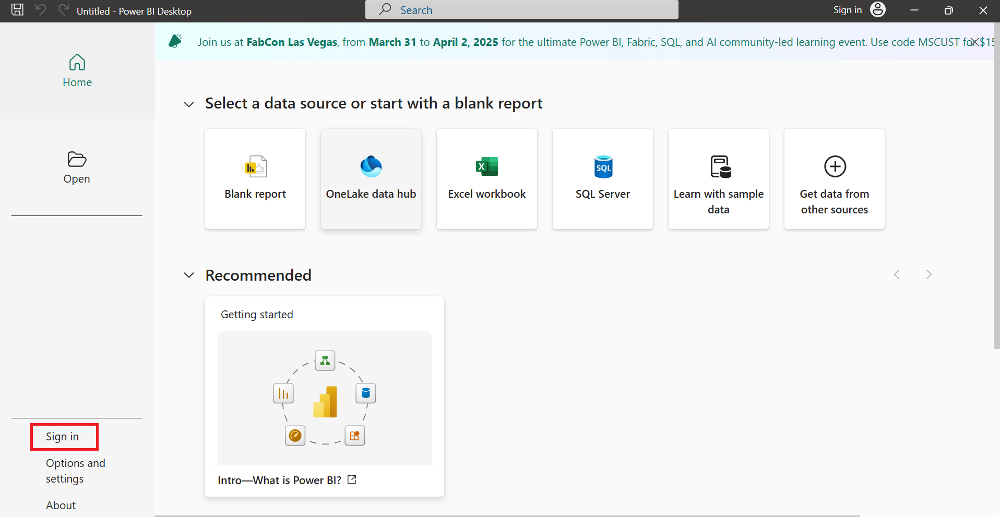
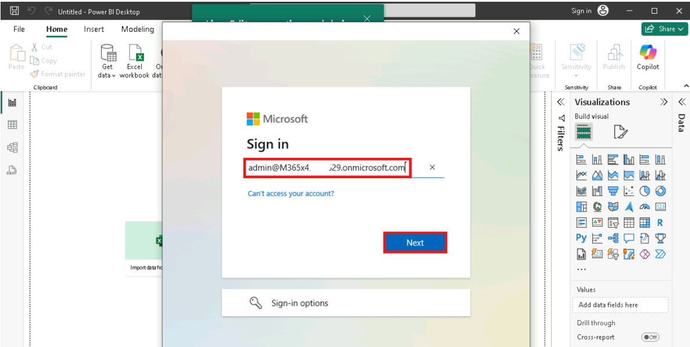
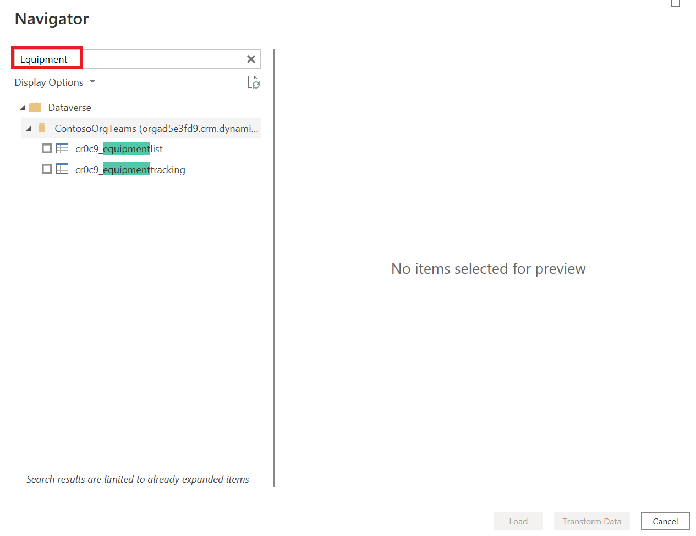

# **Lab 10: Transform Dataverse for Teams data from Power BI**

## **Exercise 1: Connect to and transform Dataverse for Teams data from Power BI**

### **Task 1: Install Power BI Desktop**

1.  Download the installer
    from !!https://www.microsoft.com/en-us/download/details.aspx?id=58494!!
    select **Download**.

    

2.  Choose **PBIDesktopSetup_x64** and click on **Next.**

    

3.  File gets downloaded into Downloads folder of the VM. After
    downloading, doubleclick on the installer file and then click
    **Next** to install.

    **Note**: Select **Yes** on **User Account Control** which asks "Do you want to allow this app to make changes to your device?"

    
    
    

5.  Click **Next**.

    

6.  Select **Accept the terms in the License Agreement** and click on
    **Next.**

    

7.  Click on **Next.**

    

8.  Click on **Install**.

    

9.  Click **Finish** when installation is done.

    

10.  This screen confirms the installation of **Power BI Desktop** on the
    lab VM.

     [A screenshot of a computer AI-generated content may be incorrect.](./media/image10.png)

11. Select **Sign in**.

    

12. If you see below screen, close the pop-up screen which says, **Dark mode** is here.
    
    

13. Enter the given **admin tenant credentials** and select **Continue**.

    

14.	Enter the given **admin tenant credentials** to sign in and then select **Next**.

    

15.	Enter **admin tenant password** and then select **Sign in**.

    

16.	Select **OK** on **Stay signed in all your apps** pop-up.

    

17.	On the **You’re all set** pop-up, select **Done**.

    
   	
### **Task 2: Get the environment URL for the Dataverse for Teams table**

    The environment URL for the Dataverse for Teams table is required when
    you are connecting with Power BI Desktop. To find the environment URL,
    follow these steps:

1.  Launch Teams or use your browser to
    open !!https://teams.microsoft.com!! and login with your Office 365
    Tenant credentials.

2.  Select the **View more apps** ellipsis then type in **Power
    apps** in the search bar. Select **Power Apps** from the search
    results.

    

3.  Click on **Build** tab and select the **Test Team** team that
    contains the Dataverse for Teams table.

    

4.  Select the **About** tab and then select **Session details**. Copy
    the **Instance URL** into notepad for later reference. The Instance
    url is the environment URL to connect Power BI Desktop to the
    Dataverse for Teams table.

    

### **Task 3: Connect to Dataverse for Teams table date**

1.  Go back to **Power BI Desktop**.

    

2.  Select **Power Platform** and then Dataverse. Click on
    **Connect** to continue.

    

3.  You may be prompted to Sign in, when you connect for the first time.
    Click **Sign in** and enter your Office 365 credentials.

    

4.  then click **Connect**.

    

5.  Enter the **environment URL** for the Dataverse for Teams table that
    you copied previously. **Remove** the **https://** protocol and the
    trailing slash **(/)** from the URL.

    

6.  Select the **Highlighted entry**, and in the **Navigator** screen,
    enter the **Name** of the table - **Equipment** to locate it. Select
    the table by selecting the check box next to the name. For this
    example, select the **EquipmentList** table that you created
    previously.

    

7.  Select **Transform Data** to open the table in Power Query Editor.

    **Note**:To enable **Transform Data** option, ensure that you have marked the box of **EquipmentList** table. 

    

8.  Next select **Import** and click **OK.**

    

    **Note**: Power Query Editor allows you to clean the data and helps make
    it easier for you to create charts, graphs, and other visualizations.
    The following steps use Power Query Editor to transform the data.

### **Task 4: Transform the data**

    Transforming data is the process of changing data to make it easier to
    work with. For example, you might want to bring in only a select few
    columns, change data types, or filter the data before creating Power BI
    reports. Dataverse for Teams tables have system columns that are used by
    Dataverse for Teams. You don't necessarily need these system columns
    when you are creating Power BI visualizations.
    
    For the EquipmentList table data, you need to remove unnecessary
    columns, rename columns, and verify that the correct data types are
    used:

1.  To reduce the number of columns select **Choose Columns** in the **Power Query
    Editor Home ribbon**. If you don’t see
    **Choose Columns**, select **Manage Columns** and then select
    **Choose Columns.**

    

2.  Select only the following **Columns**. The prefix may be different
    in your environment. Select **OK** to continue.

     **Cr0c9_equipmentlistid**
    
     **createdon**
    
     **Cr0c9_name** or **Cr0c9_newcolumn**
    
     **Cr0c9_location**
    
     **Cr0c9_locationname**
    
     **Team**
    
     

3.  Rename the columns by right clicking the column name and
    selecting **Rename**.

    

4.  **Rename** the columns as follows:

     **Cr0c9_equipmentlistid** as !!equipmentid!!
    
     **Cr0c9_name** or **Cr0c9_newcolumn** as !!equipmentname!!
    
     **Cr0c9_location** as !!location!!
    
     **Cr0c9_locationname** as !!locationname!!
    
     

    **Note**: You can also double click on the column header, rename the
    column and press enter to save the changes.

5.  You can rename the **Table** from the Queries tab on the left.
    Double -click the table name and rename it as !!equipmentlist!!.

    

6.  Select **Close & Apply** from the Home ribbon to load the data with
    the transformations into Power BI Desktop.

    
