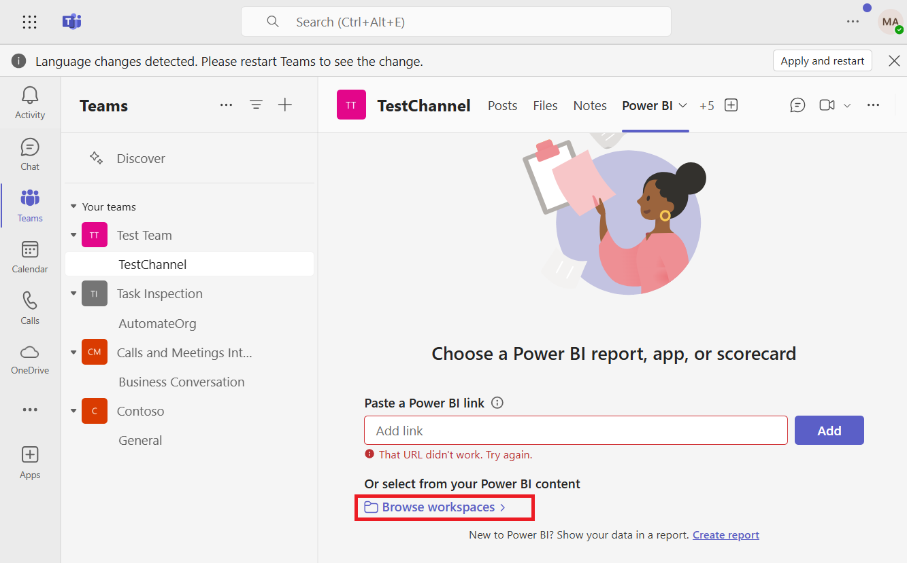

# **Lab 11: Create a Power BI report**

You can easily embed interactive Power BI reports in Microsoft Teams
channels and chats.

## **Exercise 1: Create a Power BI report**

Previously, you connected to your Dataverse for Teams table data and
then transformed it. Now, you can build a report with interactive
visualizations by using the Report view in Power BI.

### **Task 1: Add a Stacked column chart**

1.  In the **Power BI desktop**, select the **Report view**.

2.  Select the **Stacked Column Chart** icon from
    the **Visualizations** pane on the right.

3.  Select and drag the following elements from the **Fields** pane:

**Name** field to X Axis

**Equipmentlist** field to Y Axis

4.  Notice that the chart shows the data by location. As we have minimal
    amount of data in the table created, the view is as shown below.

5.  **Resize** the chart in the report canvas by selecting and dragging
    the indicated border controls. Have the chart fill up the upper-left
    portion of the canvas.

### **Task 2: Save the report**

1.  Save the report by selecting **File \> Save** **as** in the menu.

2.  Enter **EquipmentTrends** as a name and then select **Save**.

**Note**: Power BI Desktop uses a pbix file extension for its saved
files.

### **Task 3: Publish the report**

For users to access the report in Teams, the report and dataset need to
be published to a workspace. A Power BI workspace is an area to store
reports, workbooks, datasets, and dashboards in Power BI service. Every
Power BI user has a My workspace area that only they have access to.
From My workspace, users can share reports and dashboards. Members of
workspaces that are created in Power BI have access to any reports that
are published to them.

1.  From the Report view in Power BI, Select **Publish** from
    the Home ribbon.

2.  If you haven't signed into **Power BI Desktop** yet, you will be
    prompted for credentials.

After you have successfully signed in, select **My workspace** to
publish the report.

> 

3.  You will see the below message after successful publishing.

> 

## **Exercise 2: Embed a report in Microsoft Teams**

1.  Go to Microsoft Teams and select Teams from left navigation pane.

2.  Open **TestChannel** in **Microsoft Teams** and select
    the **+** icon.

3.  Search and select the **Power BI tab**.

4.  Select **Save** to create a tab.

5.  Select **Browse Workspaces**.

6.  Use the provided options to select **EquipmentTrends** report from
    **My workspace**. Click **Add**.

7.  The tab name updates automatically to match the name of the report
    name.

8.  If you want, you can change the tab name by selecting **Rename** as
    shown in the image below.

## **Exercise 3: Get a link preview**

Follow these steps to get a link preview for content in the Power BI
service.

1.  Select **App launcher** at to-left corner of the Teams.

2.  Select **Microsoft 365**.

3.  Select **Power BI**.

4.  Scroll down and go to the **Recent** tab and select your report -
    **EquipmentTrends**.

5.  Copy the link of the report from the browser address bar to the
    report in the Power BI service.

6.  Go to **Teams** using
    [**https://teams.microsoft.com**](https://teams.microsoft.com).

7.  Select **Teams** from left navigation pane. select the **Test
    Team**, browse to the **TestChannel** channel and click **Start a
    post.**

8.  Paste the link in the **Microsoft Teams** message box.

9.  The rich link preview card shows the link and relevant action
    buttons.

> 
