# **Lab 2 - Embed a model-driven app as personal app in Teams (preview)** 

### **Task 1: Create a database on existing environment**

1.  Sign into **Power Platform admin center**
    using !!https://admin.powerplatform.microsoft.com!!
    with the given admin tenant credentials.

     

2.  Select the **Environments** option on the left-hand side of the
    Portal. Click on the **Contoso (default)** environment.

     

3.  In the **Add database** section and click on **+Add database.**

     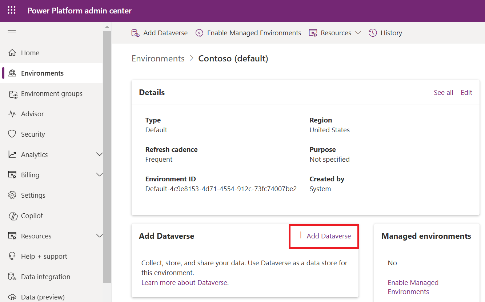

4.  **Add Dataverse** pane is now opened. Toggle the button for **Deploy
    sample apps and data** to **Yes** and then select **Add.**

     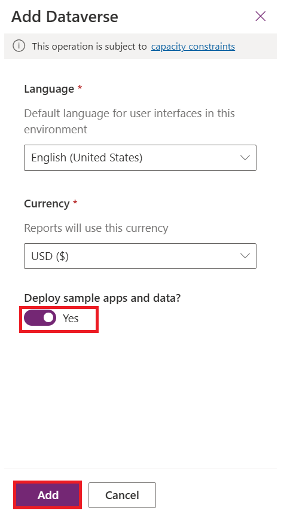

5.  This will take 2-3 minutes, and the environment will be prepared.
    You should see the state as **Ready** and Dataverse is also
    added**.**

     **Note:** You can refresh the page if the environment takes too long
     to be ready.
    
     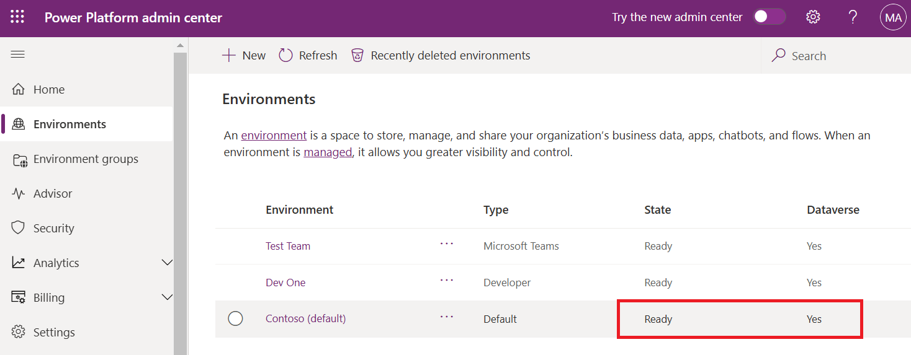

### **Task 2: Create a Model-driven app in Power Apps**

1.  Sign into **Power Apps**
    using !!https://make.powerapps.com!!
    with the given admin tenant credentials.

2.  From the environment selector, select the **Contoso (default)**
    environment.

     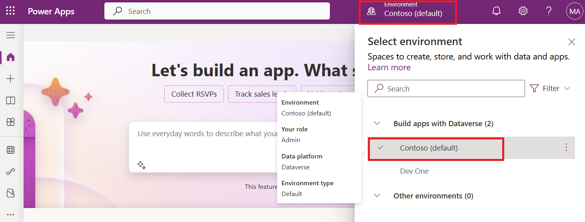

3.  Select **+Create** from the left navigation pane and then select
    **Blank app**.

     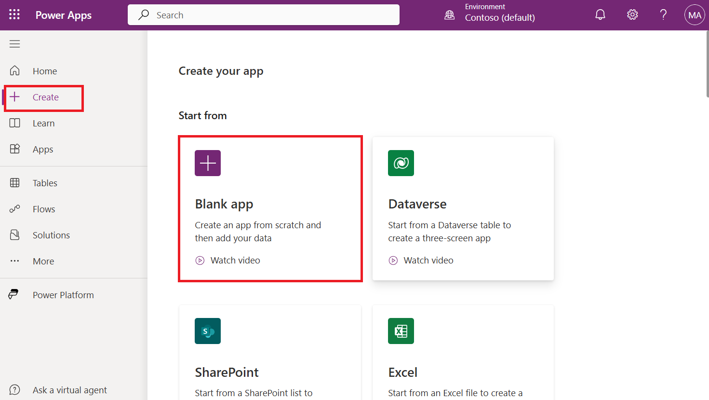

4.  Select **Create** in the **Blank app based on Dataverse** tile.

     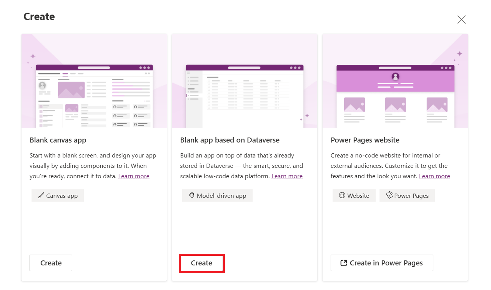

5.  On the **New Model Driven App** page, enter the following details,
    and then click **Create**:

     **Name**: Enter a name for the app, !!Account tracking!!.
    
     **Description**: Type a short description of what the app is or does,
     such as !!This is my first model-driven app!!

     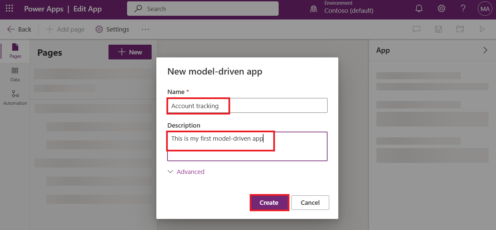

5.  Select **Add page** on the command bar, and then select **Dataverse
    table**.

     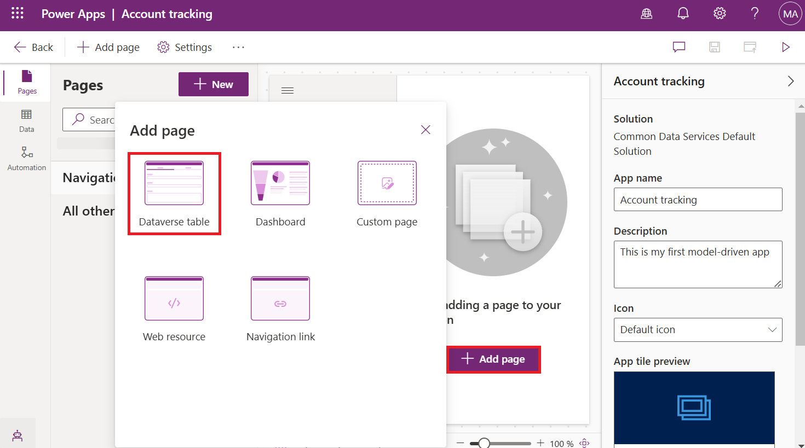

6.  Select **Account**, and then select **Add**.

     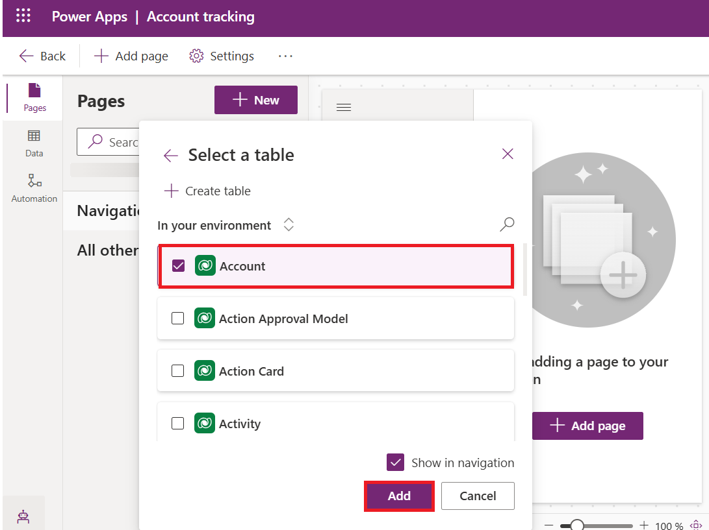

7.  Your app with the account table is displayed similarly to how it
    appears to users at run time when published.

     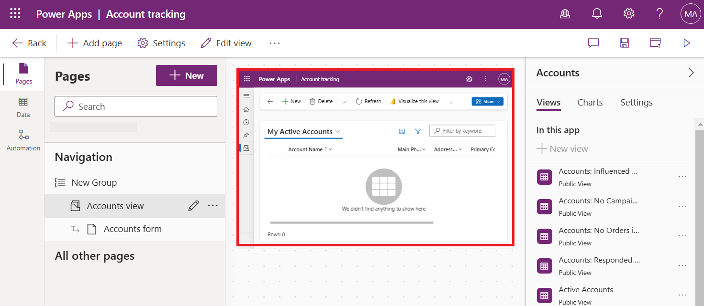

8.  **Save** the app using save icon from the toolbar.

     

9.  Select **Save and Publish** from the toolbar.

     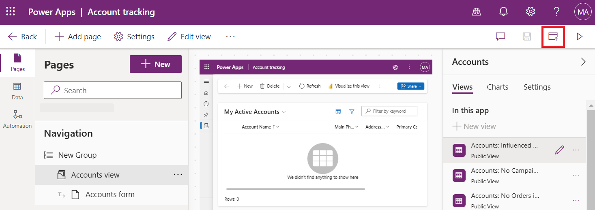

### **Task 3: Play your app**

1.  Select **Play** from the toolbar.

     

2.  This opens a new tab. To create a record, select **+ New**.

     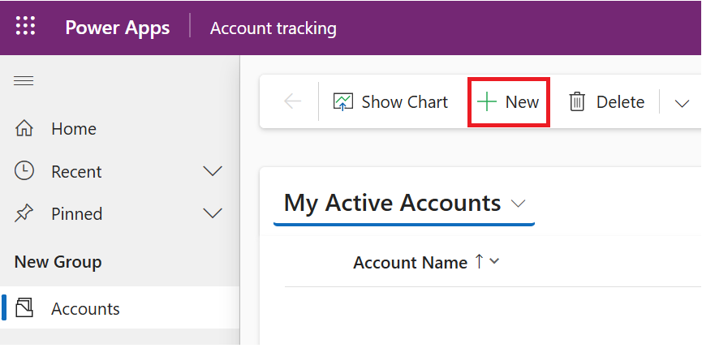

3.  Fill up the following information then select **Save & Close**.

     **Account Name:** !!Test account!!
    
     **Phone:** !!123456!!
    
     **Address 1: City:** !!Richmond!!
    
     **Address 1: Country/Region:** !!United States!!
    
     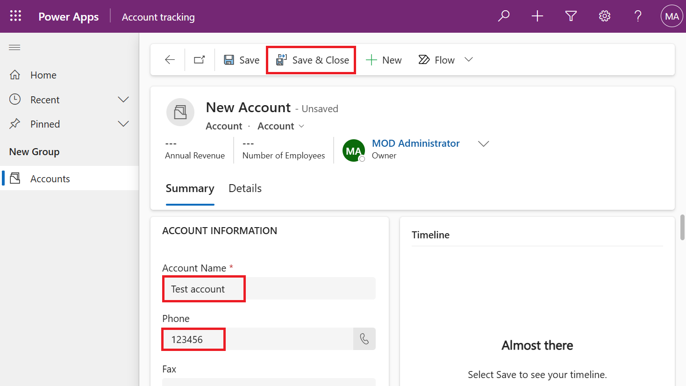

### **Task 4: Embed the app in Teams as a personal app**

1.  Sign into **Power Apps** using !!https://make.powerapps.com/!! and ensure
    that you are in **Contoso (default)** environment.

     

2.  Select **Apps** from the left navigation pane.

     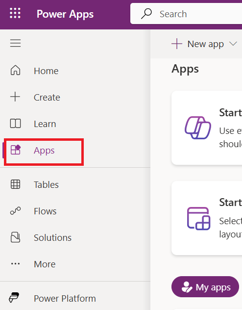

3.  Select **More actions** (...) for the **Account tracking** app you
    want to share in Teams, and then select **Share** > **Add to
    Teams**.

     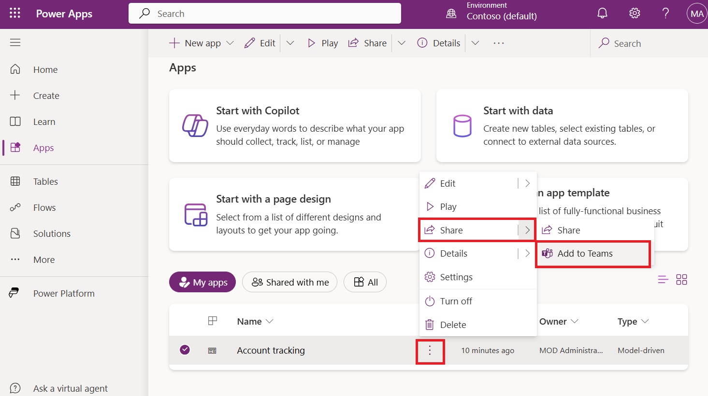

4.  **Add to Teams** panel opens on the right-side of the screen.

     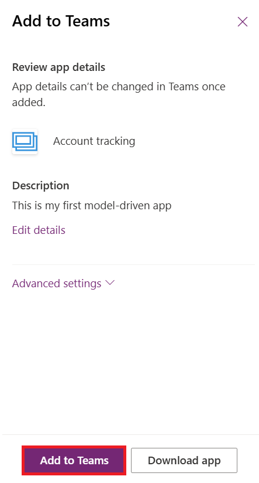

5.  You will be navigated to open the Teams. Select **Cancel** on the
    pop-up that says **Open Microsoft Team?** And then select **Use the
    web app instead**.

     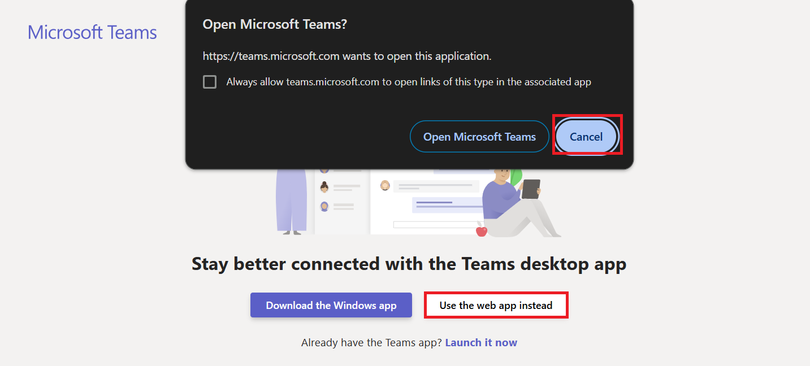

6.  Select **Add** on Account tracking app’s pane that appears on the
    screen.

     

7.  The pane now shows that the app added successfully then select
    **Open**.

     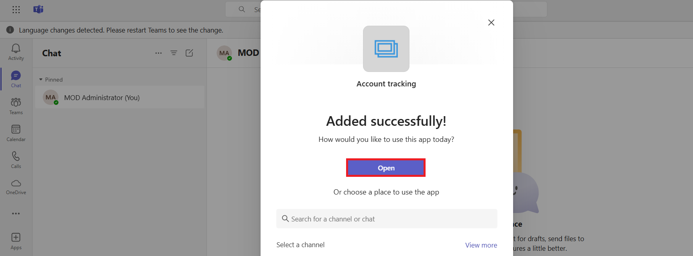

8.  You can see that app is now opened in the Teams and is also added to
    left navigation pane.

     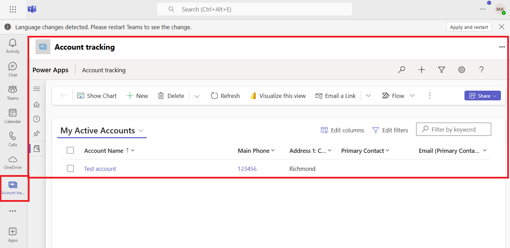
