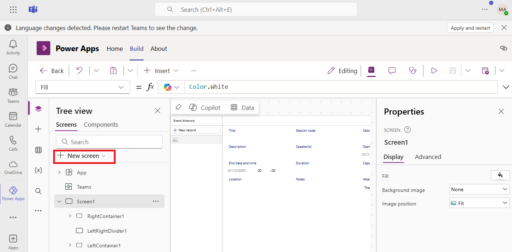
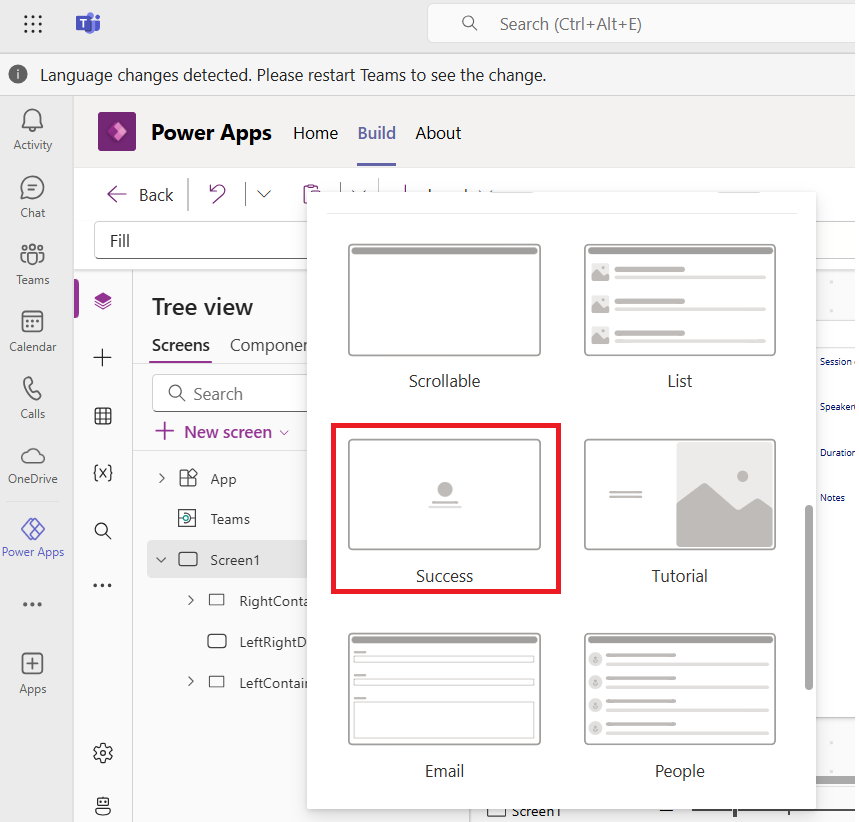
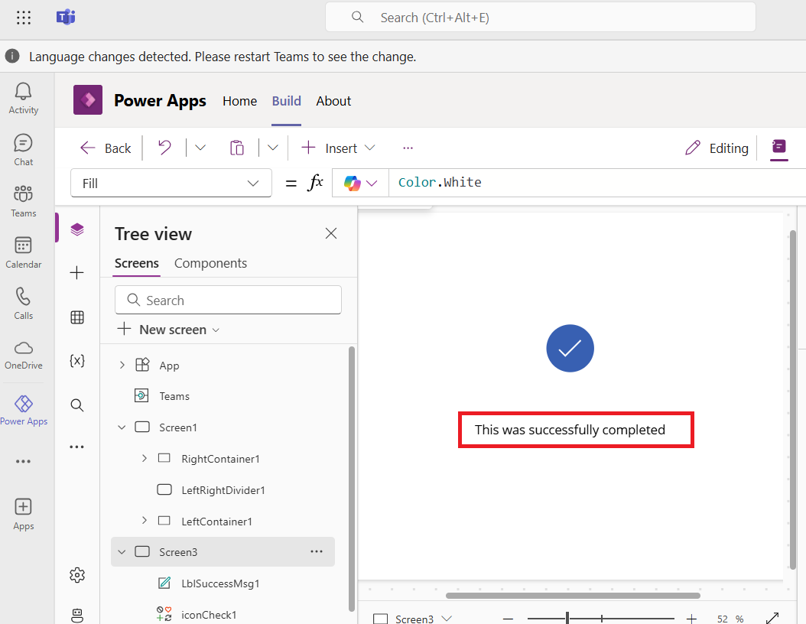
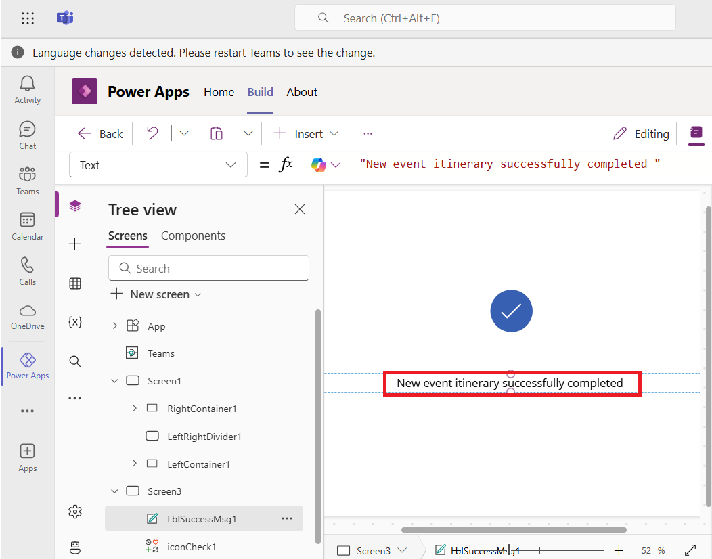
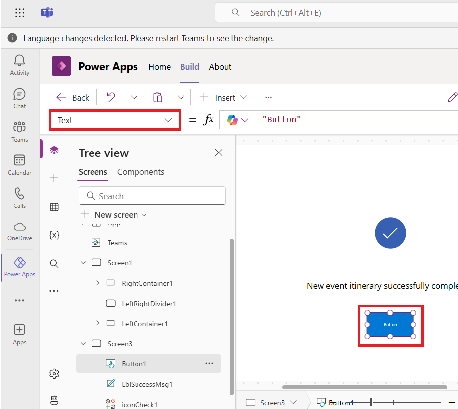
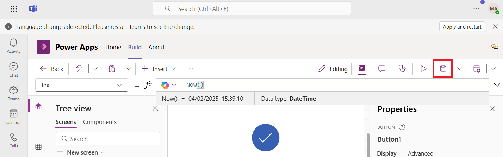
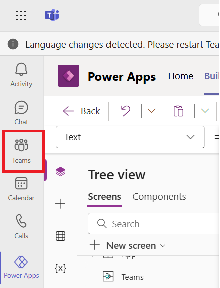
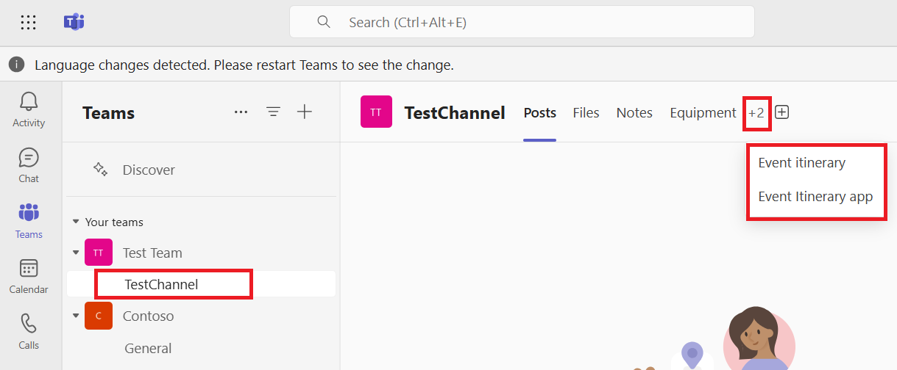

# **Lab 3 - Create a canvas app from a list in Microsoft Teams** 

### **Task 1: Add a list to a Teams channel**

1.  Sign into the Microsoft Teams
    using [**https://teams.microsoft.com/**](urn:gd:lg:a:send-vm-keys) with
    your Office 365 tenant credentials.

2.  Select **Teams** from the left navigation pane and then select
    **TestChanne**l where you want to add a list. 

> 

3.  Click on the **Add a tab** icon.

> 

4.  Search **Lists** and click on **Lists**.

  

5.  Click on **Save.**

6.  On the **Welcome to Lists** page, click on **Create a list** tab.

7.  Select a template that matches your scenario, here we have selected
    **Event itinerary** template.

> 

8.  Scroll through the template to see the default columns that come
    with it.

> 

9.  Scroll down and select **Use template**.

> 

10. Give the list a name – Event itinerary and description – Event list,
    keep the default chosen color and icon (or you can change the color
    and icon), and Select **Create**.

> 

11. The list is created with the same columns that are in the template. 

> 

### **Task 2: Create an app from a list in Microsoft Teams**

1.  On the newly created list, select **More command (…)** and then
    select **Integrate.**

> 

2.   Select **Power Apps** \> **Create an app**.

> 
>
> **Note:** If you have never used Power Apps in Teams before, you'll be
> prompted to add the Power Apps app to Teams. Select **Add** to install
> the Power Apps app in Teams

3.  In the modal that appears, enter the name as **Event Itinerary app**
    for your app and then select **Save**.

> 
>
> **Note:** Ignore the pop-up. App will open in editing mode.
>
> 

4.  The app will be created using the data from your list.

### **Task 3: Customize your app by adding and configuring controls**

Let's add a new screen and a button control. However, you can add any
type of control.

1.  To add new screen to the app, select **+New screen** from the Tree
    view.

> 

2.  Select **Success** screen.

> 

3.  Double click on the Success message and change it to “**This was
    successfully completed**”.

> 

4.  Change the success message to **‘New event itinerary successfully
    completed’**.

> 

5.  To explore more customization options, from the **Tree view**,
    with **Screen3** selected, select **Insert**. Select
    the **Button** control under **Input**.

> 

6.  The button will appear at top left corner of the canvas.

> **Note:** Adjust the sliding bar to see the button.
>
> 

7.  Drag the button below the success message as shown in the image
    below. Resize the button just by pulling its corner.

> 

8.  With the button selected on the canvas or from the tree view, select
    **Text** property from the **property selector**.

> 

9.  Change the text property to **Now()** function.

**Note:** The **Now()** function returns the current date and time in
your local time zone, and the **Text** function formats values such as
dates, times, and currency.

> 

10. Save the app using save icon.

### **Task 4: Publish App to Teams**

1.  Select **Publish to Teams** to publish your app to a channel where
    your Microsoft list is located.

2.  On the **Publish** page click **Next.**

3.  Select **+** icon next to **TestChannel**.

4.  On the **Power Apps** page, click on **Save and close** button.

5.  Select **Teams**.

6.  Select **TestChannel** and then you can see the list and the app.

