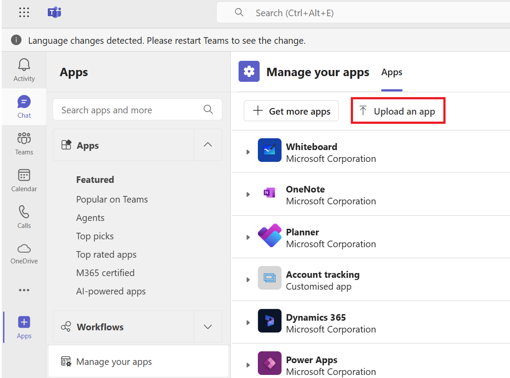
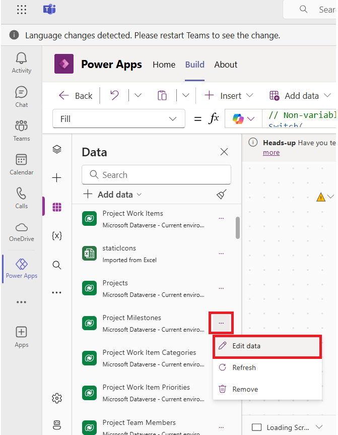

# **Lab 4: Customize sample app templates**

## **Exercise 1: Use sample app templates in Microsoft Teams**

Several sample app templates are available for use in Microsoft Teams
that you can use. You can choose the sample app template that best fits
your business requirement and quickly install it to get started. Sample
app templates created with Power Apps typically consist of multiple
components such as apps, flows, and tables.

### **Task 1: Extract AppPackages and locate TeamsCustomApp**

1.  Navigate to **C:\Labfiles** on the VM and look for
    **AppPackages.zip** file.

    

2.  Extract the ZIP file by right click on the **AppPackages.zip** and
    then click on **Extract all**.

    

3.  Click on **Extract**.

    

4.  In the **AppPackages** folder go to the '**Milestones**' folder. Find
    the **TeamsCustomApp.zip** file. Note this file location, we need
    this in next task.

   

### **Task 2: Upload the app via the Teams client**

1.  Go to **Teams** in your web browser, by following the link
    !!https://teams.microsoft.com/!!. If required, sign in with the given tenant admin credentials.

    

2.  Navigate to **Apps** click on **Manage your apps**.

    

3.  Click on **Upload an app**.

    

4.  Select **Upload an app to your org’s app catalog.**

    

5.  Navigate to **TeamsCustomApp.zip** file, the one we have extracted
    in the previous task and click on **Open**.

    

6.  Once the upload is complete, on the page of **Built for your
    organisation > Milestones** click on **Add**.

    

7.  On the pop-up card, click on **Add.**

    

8.  Select the channel - **TestChannel** in the **Test Team** and click **Go**
    to continue.

    

9.  Another pop-up card will show up. Click **Save** to start the
    installation.

    

10. Installation will take around 5 minutes, once the installation is
    complete we can start using the app.

11. If prompted allow the **App permissions**

    

12. If, **"Manage projects effectively by key
    milestones"** page appears, click on **Continue.**

   

13. Your app is ready to use.

   

   **Note:** This App can be uploaded via the Teams admin center also.

## **Exercise 2: Open the sample app templates in Power Apps Studio**

### **Task 1: Open the Sample app template**

1.  Sign in to Teams by following the link
    !!**https://teams.microsoft.com/**!!. If you are on Teams, then follow
    the next step.

    

2.  Select **View more apps (…)** Select **Power Apps**.

    

3.  Select **Build** tab.

    

4.  Select the team environment where you installed the sample app
    template. Here the team environment is **Test Team**.

    

5.  Select **Installed apps**.

    

6.  Select the sample app template that you installed i.e. **Milestones** app.

    

    **Note :** The page will take 2-5 minutes to load, if the loading fails,
      close the browser, open Teams and repeat from step 2.

7.  If prompted, select **Save and reload**.

    
   
    **Note:** If pop-up appears saying ‘**This app is read-only’** then
    select **Got it** and then select **Override** on the canvas screen.
   
    
   
    

### **Task 2: Remove sample data**

   When you install sample app templates, the tables might be pre-populated
   with sample data. The following table lists the sample app templates and
   the list of tables with the sample data to be removed:
   
1.  Make sure you are still on the Power Apps editor window and that the Milestone app is opened select **Data** from the left pane.

    

2.  Select **More actions (…)** next to the table name **Project Milestones**.
    Select **Edit data**.

    

3.  Select the rows that you want to delete in the sample data, here we
    select the **Feedback** row containing sample data, and click on
    **Delete 1 record(s)**.

    

4.  Close the visual editor.

    

### **Task 3: Add your logo to the loading screen**

1.  Select **Tree view** from the left pane.

    

2.  Ensure that you are on **Loading Screen.**

    

3.  Click on the **image** on the screen as shown in the image below.

    

4. From the properties pane that opens on the right side of the screen, select **Image** drop-down.

    

5.  From the drop-down select **+ Upload**.

    

6.  You can select an image for your company or you can use sample image from
    **C:\Labfiles** and then select **Open**.

    **Note**: If a pop-up appears that says "**A file with that name is alreay exists**" then select **Replace**.  

    

### **Task 4: Change the screen background color**

   **Note:** The Milestone app leverages global theme variables to ensure consistent
   user experience. If you modify a screen fill, the modified screen will
   no longer use the standard app theme.

1.  Considering you are still on the Power Apps editor window and
    Milestone app is opened.

2.  Select Tree view from the left pane. Select **About Screen** from
    **Tree view**.

    

3.  Select **Fill** from the property list on the top left.

    

4.  In formula bar, replace the formula with the color that you want.
    Here we enter **blue** and select the formula **Color.Blue** from
    the suggestion.

    

5.  Screen background fill color will be set to the selected background
    color.

   

### **Task 5: Publish app updates to Teams**

1.  Select **Save** from the top-right.

    

2.  Select **Publish to Teams**

    

3.  Select **Next**.

    

4.  Select **+ icon** next to **TestChannel**.

    

5.  You can see that **Milestone** app is added to **TestChannel** and then click on
    **Save and close**.

    
