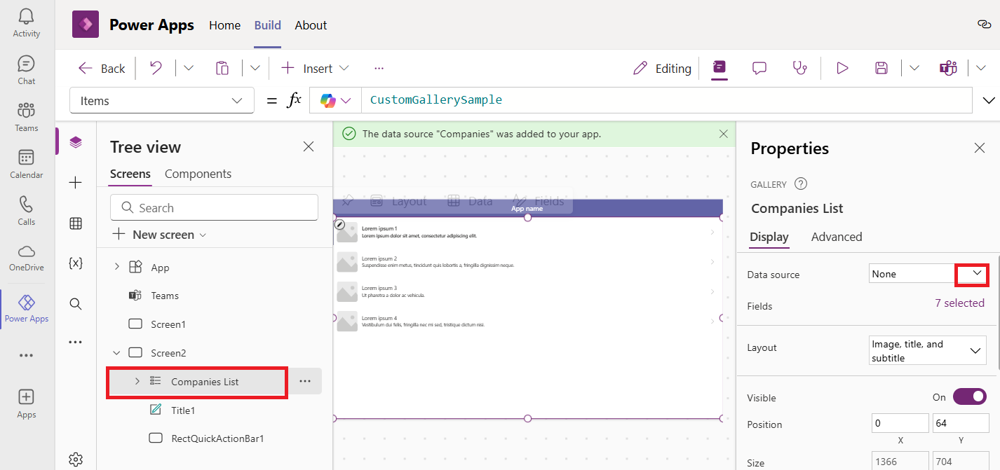
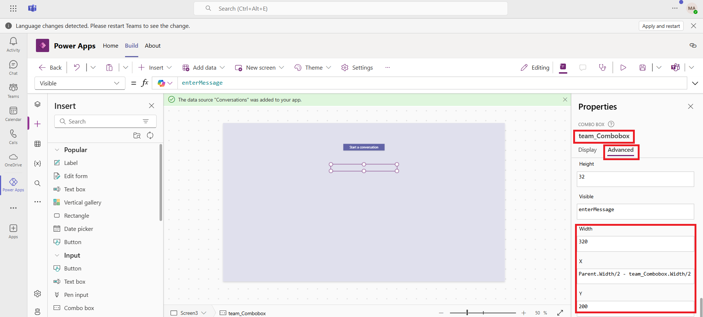
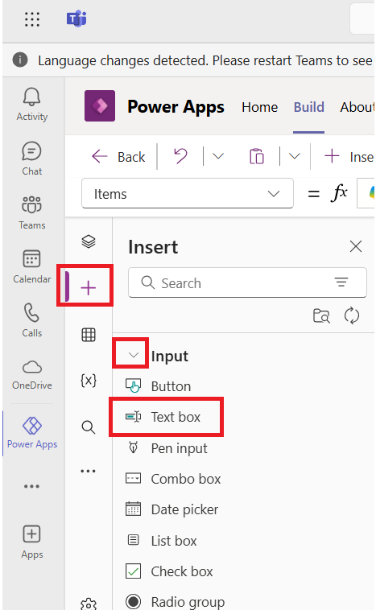
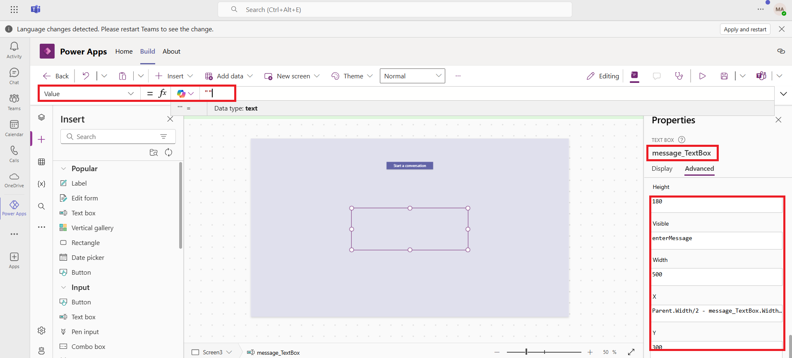
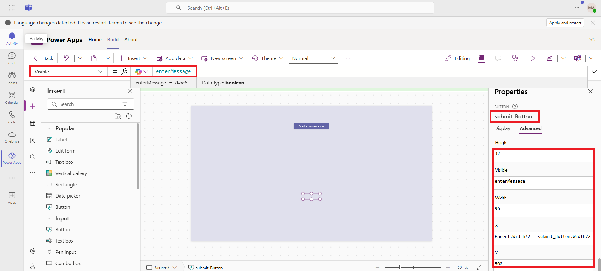
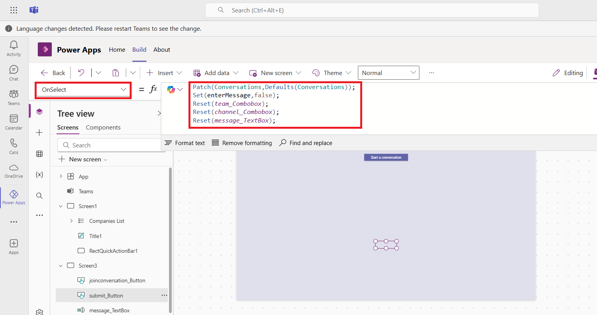
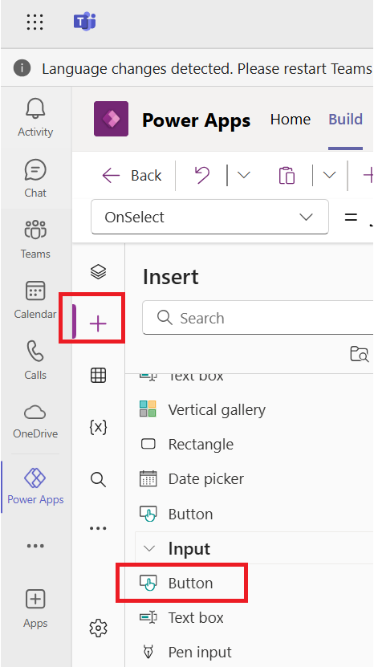
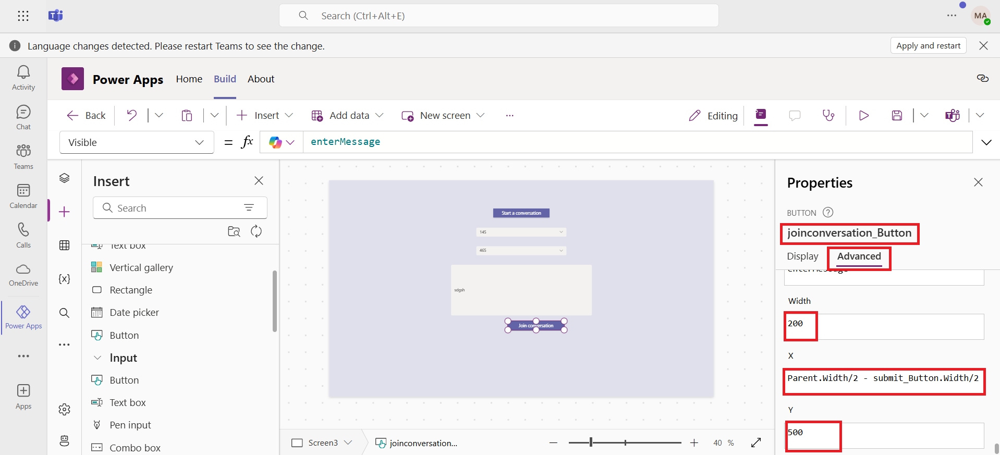
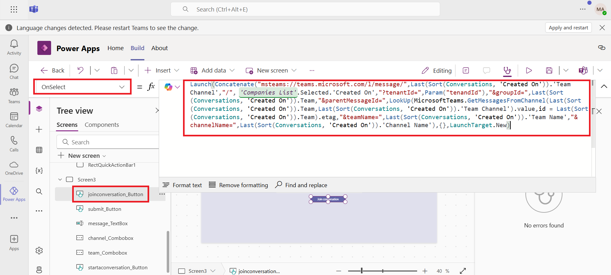
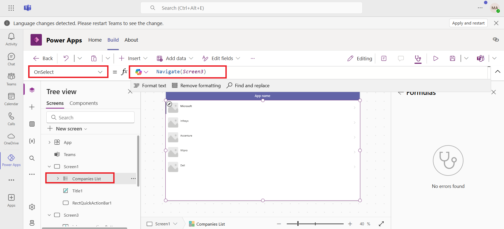

# **Lab 5: Build a canvas app to have a conversation about your business data in a Teams app**

### **Task 1: Create a new Team**

1.  To create a new team, select the Teams tab, and then select **Create
    and join teams and channels** on the top left of the navigation
    pane.

     

2.  Select **Create Team.** 

     

3.   Give the team a name such as "**Calls and Meetings Integration**",
    enter the name of the channel as **Business Conversation**, and then
    click on **Private**.

     

4.  Select **Public**.

     

5.  Select **Create**.

     

6.  For now, select **Skip** on **Add members to Calls and Meetings
    Integration**.

     
    
     The new team gets created, and is listed under the Teams tab.
    
     

### **Task 2: Create a new app**

1.  Select **(…) View more apps** and then select **Power Apps** from
    the left-pane.

     

2.  Select **+ New app** under **Recent apps**.

     

3.  Select the team **Calls and Meetings Integration**, and then
    select **Create**.

     

4.  The process for creating the app will take some time.

     
    
     
    
    The app gets created and Power Apps Studio opens to allow editing the
    app.

5.  Enter a name for the app, such as "**Conversation app**", and
    select **Save**.

     
    
     **Note:** If you see the pop-up that says ‘This app is read-only’ then
     select **Got it** and then select **Override** on the yellow note.
    
     
    
     

6.  The app is created with a default gallery on **Screen1**.

     

### **Task 3: Add Teams as a connector**

1.  Select **Data** from the left-pane, select **+ Add data**, and then
    select **Connectors**.

     

2.  Scroll down and select **See all connectors**.

     

3.  Search for and select **Teams connector**.

     

4.  Click on **Connect** button on the Microsoft Teams side pane.

     

5.  You can see that Teams connector is now added.

     

### **Task 4: Add a new table to capture company record**

    We need to add a table to maintain a list of companies we'll use as the company record, and to start a conversation about it.

1.  Select **Data** from the left-pane. Select **+ Add data** and then
    select **Create a new table**.

     

2.  On **Create a new table page,** click on **Start with a blank
    table.**

     

3.  Select **pencil icon** next to **New table** to give a name. Enter
    the name as **Company** and then select **Save**.

     

4.  After adding Display name, add following company names in the table
    column one by one by hitting enter button and then click on **Save
    and close**.

     !!Microsoft!!, !!Infosys!!, !!Accenture!!, !!Wipro!!, !!Dell!! and !!Google!!.
    
     

### **Task 5: Add a new screen to select the customer**

    Next, we'll add a screen to the app so that users can select thecustomer that they want to have the conversation about.

1.  In the tree view, select **+ New screen.**  Select **List**.

     
    
     A new screen gets added with a gallery list.
    
     

2.  Update the title of the gallery to "**Companies List**".

     
    
     

3.  **Companies List** selected from the **Tree view**, click on
    drop-down for **Data source** under the **Properties** pane.

     

4.  Select **Companies** as the data source for the gallery.

     

5.  The list of companies that was added shows up in the
    gallery **Companies List**.

     

6.  Delete **Screen1** from the tree view. Click on **(…)** in front of
    **Scrren1** and then select **Delete**.

     

7.  Double click on Screen2 in the tree view and rename it
    to **Screen1**.

     

### **Task 6: Add a new table to capture the conversation details**

    We need to add another table to capture the details such as the Teams
    conversation ID, team, and channel related to a conversation started in
    the app.

1.  Select **Data** > **+ Add data** > **Create new table**.

     

2.  Select the **Start with a blank table** template to build a new
    table.

     

3.  Click on the **Pencil** icon, beside **New table**. Enter table name
    as **Conversation.**  Click on **Save** and then select **Save and
    close.**

     

4.  Click on the ellipse beside the newly created conversations table
    and select edit data.

     

5.  Click on **+ New column** and add a new column enter the details and
    then select **Save**.

     **Display name:** !!Team!!
    
     **Data type:** Text
    
     
    
     Repeat the procedure and add the following columns to the conversation table.
    
     **Column:** !!Team Channel!!, **Type:** Text
    
     **Column:** !!Team Name!!, **Type:** Text
    
     **Column:** !!Channel Name!!, **Type:** Text
    
     **Column:** !!Company!!, **Type:** Lookup, related table= Company
    
     

6.  You can now see new columns are now added to the table and then
    select **Close**.

     

### **Task 7: Add a new screen to start or join a conversation**

    Now, we'll add a new screen where the app user can start or join aconversation.

1.  In the tree view, select **+ New screen** > **Blank layout**.

     

2.  Update the **Fill** property of the screen to !!RGBA(224, 224, 237, 1)!!.

     

3.  Select **+** (Insert) > **Input** > **Button**.

     

4.  Update the following properties of the button. You can update the properties by seleting it one by one from **Property selector**.

     **Name:** !!startaconversation_Button!!
    
     **Text:** !!"Start a conversation"!!
    
     **Font size:** 12
    
     **Size:** Width -200 and Height- 32
    
     **Position:** X-583 and Y-100
    
     **OnSelect:** !!Set(enterMessage,true)!!
    
     
    
     

5.  Select **+ (Insert)** > **Input** > **Combo box**.

     

6.  Name the Combo box as - !!**team_Combobox**!! and select **Advanced** tab and then update the following properties of the Combo box. Or you         can update the properties by seleting it one by one from **Property selector**.

     **Items:** !!MicrosoftTeams.GetAllTeams().value!!
    
     **Width:** 320
    
     **Height:** 32
    
     **X:** !!Parent.Width/2 - team_ComboBox.Width/2!!
    
     **Y:** 200
    
     **Text:** !!"Team"!!
    
     **Tooltip:** !!"Team"!!
    
     **Visible:** !!enterMessage!!
    
     

7.  Add another combo box and update the following properties.

     **Name:** !!channel_Combobox!!
    
     **Items:**
     !!If(!IsBlank(*team_Combobox*.Selected.id),MicrosoftTeams.GetChannelsForGroup(*team_Combobox*.Selected.id).value)!!
    
     **Width:** 320
    
     **Height:** 32
    
     **X:** !!Parent.Width/2 - channel_ComboBox.Width/2!!
    
     **Y:** 200
    
     **Text:** !!"Channel"!!
    
     **Tooltip**: !!"Channel"!!
    
     **Visible** : !!enterMessage!!
    
     

8.  Select **+(Insert)**  > **Input** > **Text box**.

     

9.  Update the following properties of the Textbox

     **Name:** !!message_TextBox!!
    
     **Value:** ""
    
     **Width**: 500
    
     **Height**: 180
    
     **X:** !!Parent.Width/2 - message_TextBox.Width/2!!
    
     **Y**: 300
    
    **Placeholder**: !!Type message here!!
    
     **Visible**: !!enterMessage!!
    
     

10. Select **+(Insert)** > **Input** > **Button**.

     

11. Update the following properties of the button.

     **Name:** !!submit_Button!!
    
     **Text**: !!"Submit"!!
    
     **Width**: 96
    
     **Height**: 32
    
     **Font size**: 12
    
     **X**: !!Parent.Width/2 - submit_Button.Width/2!!
    
     **Y**: 500
    
     **Visible**: !!enterMessage!!
    
     

12. From the Property selector, select the **OnSelect** property and
    copy the following formula.

     !!Patch(Conversations,Defaults(Conversations));!!
    
     !!Set(enterMessage,false);!!
    
     !!Reset(*team_Combobox*);!!
    
     !!Reset(*channel_Combobox*);!!
    
     !!Reset(*message_TextBox*);!!
    
     

13. Select **+** (Insert) > **Input** > **Button**. Adust the positions of all the newly created buttons and comboBoxes on the canvas by             seleting them from the tree view. So that they will appear correctly when you test the app.

     

14. Update the following properties of the button.

     **Name:** !!joinconversation_Button!!
    
     **Text:** !!"Join conversation"!!
    
     **Width:** 200
    
     **Height:** 32
    
     **Font size**: 12
    
     **X**: !!Parent.Width/2 - submit_Button.Width/2!!
    
     **Y**: 500
    
     **Visible:** !!enterMessage!!
    
     

15. From the Property selector, select the **OnSelect** property and
    copy the following formula.

     !!Launch(Concatenate("msteams://teams.microsoft.com/l/message/",Last(Sort(Conversations,
     'Created On')).'Team Channel',"/", *'Companies
     List'*.Selected.'Created
     On',"?tenantId=",Param("tenandId"),"&groupId=",Last(Sort(Conversations,
     'Created
     On')).Team,"&parentMessageId=",LookUp(MicrosoftTeams.GetMessagesFromChannel(Last(Sort(Conversations,
     'Created On')).Team,Last(Sort(Conversations, 'Created On')).'Team
     Channel').value,id = Last(Sort(Conversations, 'Created
     On')).Team).etag,"&teamName=",Last(Sort(Conversations, 'Created
     On')).'Team Name',"&channelName=",Last(Sort(Conversations, 'Created
     On')).'Channel Name'),{},LaunchTarget.New)!!

    

### **Task 8: Update the gallery OnSelect Property**

1.  Select **Screen1** from the tree view and then select
    the **Companies List** gallery.

2.  Set the **OnSelect** property of the gallery item to **Navigate
    (Screen3)**.

     

### **Task 9: Save and publish the app**

1.  Select **Save** on the top-right to save the app.

     

2.  Select **Publish** on the top-right to publish the app.

     

3.  Select **Next**.

     

4.  Select **+ icon** next to **Business Conversation** channel. You can
    see the Conversation app is added to the channel. Select **Save and
    Close** to complete the publishing of the app.

     

### **Task 10: Testing the app**

    Run the app in preview mode or go to the team in which the app iscreated.

1.  Select **Test** icon.

     

2.  The Companies gallery should show up as the first screen. Select one
    of the companies.

     

3.  You should only see two buttons: **Start a conversation** and **Join
    a conversation**.

4.  Select **Start a conversation**.

5.  Additional fields should show up:

    - Team (dropdown with a list of teams)

    &nbsp;

    - Channel (dropdown list of channels within the selected team)

    &nbsp;

    - Message box (text box to type in the message to be sent to the
      team)

    &nbsp;

    - Submit button (to submit the message)

6.  Select a team.

7.  Select a channel within the team.

8.  Enter message.

9.  Select **Submit**. All the additional fields/controls get hidden.

     

10. Select **Join conversation** to be taken to the team and channel
    chat where the last message was sent.

     
