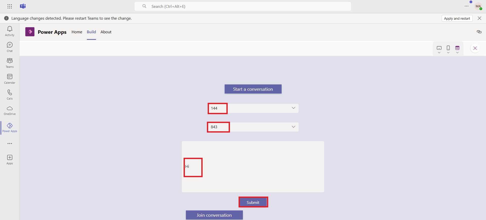

# **Lab 5: Build a canvas app to have a conversation about your business data in a Teams app**

### **Task 1: Create a new Team**

1.  To create a new team, select the Teams tab, and then select **Create
    and join teams and channels** on the top left of the navigation
    pane.

> 

2.  Select **Create Team.** 

> 

3.   Give the team a name such as "**Calls and Meetings Integration**",
    enter the name of the channel as **Business Conversation**, and then
    click on **Private**.

> 

4.  Select **Public**.

> 

5.  Select **Create**.

> 

6.  For now, select **Skip** on **Add members to Calls and Meetings
    Integration**.

> 
>
> The new team gets created, and is listed under the Teams tab.
>
> 

### **Task 2: Create a new app**

1.  Select **(…) View more apps** and then select **Power Apps** from
    the left-pane.

> 

2.  Select **+ New app** under **Recent apps**.

> 

3.  Select the team **Calls and meeting Integration**, and then
    select **Create**.

> 

4.  The process for creating the app will take some time.

> 
>
> 

The app gets created and Power Apps Studio opens to allow editing the
app.

5.  Enter a name for the app, such as "**Conversation app**", and
    select **Save**.

> 
>
> **Note:** If you see the pop-up that says ‘This app is read-only’ then
> select **Got it** and then select **Override** on the yellow note.
>
> 
>
> 

6.  The app is created with a default gallery on **Screen1**.

### **Task 3: Add Teams as a connector**

1.  Select **Data** from the left-pane, select **+ Add data**, and then
    select **Connectors**.

> 

2.  Scroll down and select **See all connectors**.

> 

3.  Search for and select **Teams connector**.

> 

4.  Click on **Connect** button on the Microsoft Teams side pane.

5.  You can see that Teams connector is now added.

### **Task 4: Add a new table to capture company record**

We need to add a table to maintain a list of companies we'll use as the
company record, and to start a conversation about it.

1.  Select **Data** from the left-pane. Select **+ Add data** and then
    select **Create a new table**.

> 

2.  On **Create a new table page,** click on **Start with a blank
    table.**

3.  Select **pencil icon** next to **New table** to give a name. Enter
    the name as **Company** and then select **Save**.

4.  After adding Display name, add following company names in the table
    column one by one by hitting enter button and then click on **Save
    and close**.

Microsoft, Infosys, Accenture, Wipro, Dell and Google.

### **Task 5: Add a new screen to select the customer**

Next, we'll add a screen to the app so that users can select the
customer that they want to have the conversation about.

1.  In the tree view, select **+ New screen.**  Select **List**.

> 
>
> A new screen gets added with a gallery list.
>
> 

2.  Update the title of the gallery to "**Companies List**".

> 
>
> 

3.  **Companies List** selected from the **Tree view**, click on
    drop-down for **Data source** under the **Properties** pane.

> 

4.  Select **Companies** as the data source for the gallery.

> 

5.  The list of companies that was added shows up in the
    gallery **Companies List**.

6.  Delete **Screen1** from the tree view. Click on **(…)** in front of
    **Scrren1** and then select **Delete**.

> 

7.  Double click on Screen2 in the tree view and rename it
    to **Screen1**.

> 

### **Task 6: Add a new table to capture the conversation details**

We need to add another table to capture the details such as the Teams
conversation ID, team, and channel related to a conversation started in
the app.

1.  Select **Data** \> **+ Add data** \> **Create new table**.

> 

2.  Select the **Start with a blank table** template to build a new
    table.

> 

3.  Click on the **Pencil** icon, beside **New table**. Enter table name
    as **Conversation.**  Click on **Save** and then select **Save and
    close.**

> 

4.  Click on the ellipse beside the newly created conversations table
    and select edit data.

5.  Click on **+ New column** and add a new column enter the details.

> **Display name:** Team
>
> **Data type:** Text
>
> 
>
> Repeat the procedure and add the following columns to the conversation
> table:

[TABLE]

> 

6.  You can now see new columns are now added to the table and then
    select **Close**.

> 

## Task 7: Add a new screen to start or join a conversation

Now, we'll add a new screen where the app user can start or join a
conversation.

1.  In the tree view, select **+ New screen** \> **Blank layout**.

> 

2.  Update the **Fill** property of the screen to RGBA(224, 224, 237,
    1).

> 

3.  Select **+** (Insert) \> **Input** \> **Button**.

> 

4.  Update the following properties of the button.

> Name: startaconversation_Button
>
> Text:
>
> Font size:
>
> Size: Width -200 and Height- 32
>
> Position: X-583 and Y-100
>
> OnSelect: Set(enterMessage,true)
>
> 
>
> 

5.  Select **+** (Insert) \> **Input** \> **Combo box**.

> 

6.  Name the Combo box as - **team_Combobox** and select **Advanced**
    tab and then update the following properties of the Combo box.

[TABLE]

7.  Add another combo box and update the following properties.

[TABLE]

8.  Select **+** (Insert) \> **Input** \> **Text box**.

> 

9.  Update the following properties of the Textbox

[TABLE]

10. Select **+** (Insert) \> **Input** \> **Button**.

11. Update the following properties of the button.

[TABLE]

12. Click the **Advanced** tab and copy the following formula in
    the **OnSelect** event of the button.

Patch(Conversations,Defaults(Conversations),{ID:MicrosoftTeams.PostMessageToChannelV3(team_ComboBox.Selected.id,channel_ComboBox.Selected.id,{content:message_TextBox.Value,contentType:
"text"},{subject:"New
conversation"}).id,Team:team_ComboBox.Selected.id,'Team
Channel':channel_ComboBox.Selected.id, 'Team
Name':team_ComboBox.Selected.displayName,'Channel
Name':channel_ComboBox.Selected.displayName, Company:
TemplateGalleryList1.Selected}); Set(enterMessage,false);
Reset(team_ComboBox);Reset(channel_ComboBox);Reset(message_TextBox)

** Note**

- In the above formula, we're using the **Patch** function to create a
  row in the **Conversations** table to capture the conversation ID
  along with the team, team name, channel and channel came. At the same
  time, we're also posting a message in the appropriate team and channel
  using the **PostMessageToChannelV3** function. We then set
  the **enterMessage** variable back to "false" to hide some of the
  fields and buttons whose visibility depends on this variable.

&nbsp;

- The subject is hardcoded to “New conversation" to keep the app simple
  ,and not add another text box control to capture. But a text box can
  be added for subject to the screen and can be captured by the user.
  This formula will need to be adjusted accordingly to reference that
  control. The **Reset** function doesn't work for the **Fluent UI
  Combobox** control. This is needed to not have any team or channel
  selected once a message is posted.

13. Select **+** (Insert) \> **Input** \> **Button**.

14. Update the following properties of the button.

Expand table

[TABLE]

15. In the **Advanced** tab Copy the following formula in
    the **OnSelect** event of the button.

Power FxCopy

Launch(Concatenate("msteams://teams.microsoft.com/l/message/",Last(Sort(Conversations,
'Created On', Ascending)).'Team
Channel',"/",Gallery1.Selected.etag,"?tenantId=",Param("tenandId"),"&groupId=",Last(Sort(Conversations,
'Created On',
Ascending)).Team,"&parentMessageId=",LookUp(MicrosoftTeams.GetMessagesFromChannel(Last(Sort(Conversations,
'Created On', Ascending)).Team,Last(Sort(Conversations, 'Created On',
Ascending)).'Team Channel').value,id = Last(Sort(Conversations, 'Created
On', Ascending)).Team).etag,"&teamName=",Last(Sort(Conversations,
'Created On', Ascending)).'Team
Name',"&channelName=",Last(Sort(Conversations, 'Created On',
Ascending)).'Channel Name'),{},LaunchTarget.New)

** Note**

- In the above formula, we're using the **Launch** function to launch
  Teams using the team and channel parameters of the last record that
  was created in the **Conversations** table. We're doing this so that
  when a user starts a conversation and submits a message to post to a
  channel, the user can then select the **Join Conversation** button to
  go to the Teams post directly.

&nbsp;

- We're using the last function here to keep it simple. If you
  anticipate using this app more extensively and anticipate having
  multiple conversations, you could get creative by using a gallery of
  conversations, and letting the user select which conversation they'd
  want to join.\*

## Task 8: Update the gallery OnSelect Property

Next, we'll update the **OnSelect** property of the company gallery so
that when a user selects a company from the list, the app will go to the
second screen.

1.  Select **Screen2** from the tree view to open
    the **Companies** gallery.

2.  Set the **OnSelect** property of the gallery item to Navigate
    (Screen1).

## Task 9: Save and publish the app

1.  Select **Save** on the top-right to save the app.

2.  Select **Publish** on the top-right to publish the app.

3.  Select **Next**.

4.  Under **Add to Channel**, make sure the channel under which the app
    should be shown is listed and shows as "1 active tab(s)" and not "0
    active tab(s)".

5.  Select **Save and Close** to complete the publishing of the app.

## Task 10: Testing the app

Run the app in preview mode or go to the team in which the app is
created.

1.  The Companies gallery should show up as the first screen.

2.  Select one of the companies.

3.  You should only see two buttons: **Start a conversation** and **Join
    a conversation**.

4.  Select **Start a conversation**.

5.  Additional fields should show up:

    - Team (dropdown with a list of teams)

    &nbsp;

    - Channel (dropdown list of channels within the selected team)

    &nbsp;

    - Message box (text box to type in the message to be sent to the
      team)

    &nbsp;

    - Submit button (to submit the message)

6.  Select a team.

7.  Select a channel within the team.

8.  Enter message.

9.  Select **Submit**. All the additional fields/controls get hidden.

10. Select **Join conversation** to be taken to the team and channel
    chat where the last message was sent.

## 
