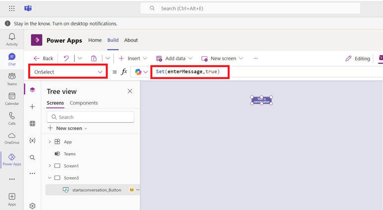
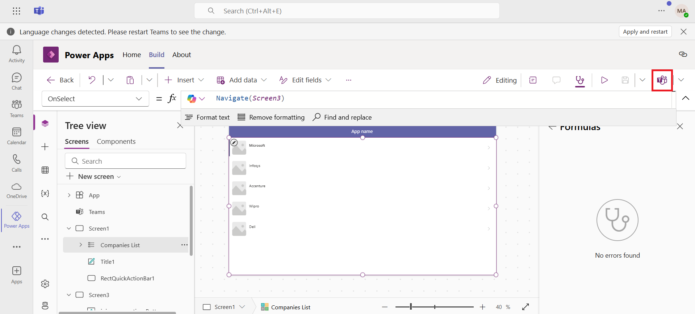
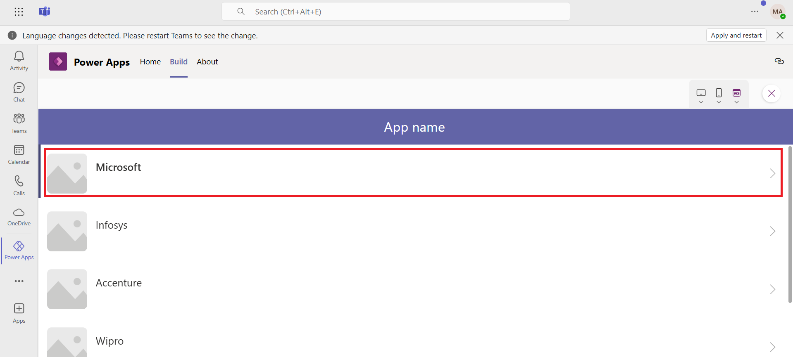

# **Lab 5: Build a canvas app to have a conversation about your business data in a Teams app**

### **Task 1: Create a new Team**

1. Sign into the **Microsoft Teams** using !!https://teams.microsoft.com/!! with the given admin tenant credentials. To create a new team,          select the **Teams** tab, and then select **+ icon** (Create and join teams and channels) on the top left of the navigation
   pane.

     

2.  Select **Create Team.** 

     

3.   Give the team a name such as !!Calls and Meetings Integration!!,
    enter the name of the channel as !!Business Conversation!! and then
    click on **Private**.

     

4.  Select **Public**.

     

5.  Select **Create**.

     

6.  For now, select **Skip** on **Add members to Calls and Meetings
    Integration**.

     
    
     The new team gets created, and is listed under the Teams tab.
    
     

### **Task 2: Create a new app**

1.  Select **(…) View more apps** and then select **Power Apps** from
    the left-pane.

     

2.  Select **+ New app** under **Recent apps**.

     

3.  Select the team **Calls and Meetings Integration**, and then
    select **Create**.

     

4.  The process for creating the app will take 2-3 minutes, if it takes more than that then refresh the window and repeat the above steps (Step       1 - 3).

     
    
     
    
    The app gets created and Power Apps Studio opens to allow editing the
    app.

5.  Enter a name for the app, such as !!Conversation app!! and
    select **Save**.

     
    
     **Note:** If you see the pop-up that says ‘This app is read-only’ then
     select **Got it** and then select **Override** on the yellow note.
    
     
    
     

6.  The app is created with a default gallery on **Screen1**.

     

### **Task 3: Add Teams as a connector**

1.  Select **Data** from the left-pane, select **+ Add data**, and then
    select **Connectors**.

     

2.  Scroll down and select **See all connectors**.

     

3.  Search for and select **Microsoft Teams** connector.

     

4.  Click on **Connect** button on the Microsoft Teams side pane.

     

5.  You can see that Teams connector is now added.

     

### **Task 4: Add a new table to capture company record**

    We need to add a table to maintain a list of companies we'll use as the company record, and to start a conversation about it.

1.  Select **Data** from the left-pane. Select **+ Add data** and then
    select **Create a new table**.

     

2.  On **Create a new table page,** click on **Start with a blank
    table.**

     

3.  Select **pencil icon** next to **New table** to give a name. Enter
    the name as !!Company!! and then select **Save**.

     

4.  After adding the Display name, add following company names in the table
    column one by one by hitting the Enter key and then click on **Save
    and close**.

     !!Microsoft!!, !!Infosys!!, !!Accenture!!, !!Wipro!!, !!Dell!! and !!Google!!.
    
     

### **Task 5: Add a new screen to select the customer**

    Next, we'll add a screen to the app so that users can select the customer that they want to have the conversation about.

1.  In the tree view, select **+ New screen.**  Select **List**.

     
    
     A new screen gets added with a gallery list.
    
     

2.  Double-click on **TemplateGalleryList1** under **Screen2** and replace it by the new title !!Companies List!!.

     
    
     

3.  With the **Companies List** selected from the **Tree view**, click on
    drop-down for **Data source** under the **Properties** pane.

     

4.  Select **Companies** as the data source for the gallery.

     

5.  The list of companies that was added shows up in the
    gallery **Companies List**.

     

6.  Delete **Screen1** from the tree view. Click on **(…)** in front of
    **Scrren1** and then select **Delete**.

     

7.  Double click on Screen2 in the tree view and rename it
    to **Screen1**.

     

### **Task 6: Add a new table to capture the conversation details**

    We need to add another table to capture the details such as the Teams
    conversation ID, team, and channel related to a conversation started in
    the app.

1.  Select **Data** > **+ Add data** > **Create new table**.

     

2.  Select the **Start with a blank table** template to build a new
    table.

     

3.  Click on the **Pencil** icon, beside **New table**. Enter table name
    as !!Conversation!!.  Click on **Save**.

     

4.  Click on **+ New column** and add a new column enter the details and
    then select **Save**.

     **Display name:** !!Team!!
    
     **Data type:** Text
    
     
    
     Repeat the procedure and add the following columns to the conversation table.
    
     **Column:** !!Team Channel!!, **Type:** Text
    
     **Column:** !!Team Name!!, **Type:** Text
    
     **Column:** !!Channel Name!!, **Type:** Text
    
     **Column:** !!Company!!, **Type:** Lookup, related table= Company
    
     

5.  You can now see new columns are now added to the table and then
    select **Save and close**.

     

### **Task 7: Add a new screen to start or join a conversation**

    Now, we'll add a new screen where the app user can start or join aconversation.

1.  In the tree view, select **+ New screen** > **Blank layout**.

     

2.  Update the **Fill** property of the screen to !!RGBA(224, 224, 237, 1)!!.

     

3.  Select **+** (Insert) > **Input** > **Button**.

     

4. Double-click on the **Button1** under the **Screen3** from the **Tree view** and rename it to !!startaconversation_Button!!.

   

   
   
5.	Update the properties of the **startaconversation_Button** by selecting it one by one from **Property selector**.
   
   **Text**: !!"Start a conversation"!!
   
   **OnSelect**: !!Set(enterMessage,true)!!

   

6.	Select **startaconversation_Button** on the canvas and drag it at the place shown in the image below.

   

7.	Select **+ (Insert)** > **Input** > **Combo box**.

   

8.	Double-click on the **ComboBox1** under **Screen3** and rename it to !!team_Combobox!!.

   

9.	Update the following properties of the **team_Combobox** by selecting it one by one from **Property selector**.
    
   **Items**:  !!MicrosoftTeams.GetAllTeams().value!!
   
   **Text**: !!"Team"!!
   
   **Tooltip**:  !!"Team"!!
   
   **Visible**:  !!enterMessage!!

   

10. Select **team_Combobox** on the canvas and drag it under the **startaconversation_Button** as shown in the image below.

    

11. Add another combo box, rename it to !!channel_Combobox!!, update the following properties and then drag it below the **team_Combobox**.

   **Items**: !!If(!IsBlank(team_Combobox.Selected.id),MicrosoftTeams.GetChannelsForGroup(team_Combobox.Selected.id).value)!!
   
   **Text**: !!"Channel"!!
   
   **Tooltip**: !!"Channel"!!
   
   **Visible**: !!enterMessage!!

   

   **Note**: Do not place it immediately below Start a conversation button. There is teams_Combobox button which is invisible right now. To view    that you can select it from Tree view. 

12. Select **+ (Insert)** > **Input** > **Text box**.

   
   
13. Rename the Text box to !!message_TextBox!!, update the following properties of the textbox and then drag it below the **channel_Combobox**.

    **Value**:	""
    
   **Placeholder**:	!!“Type message here”!!
   
   **Visible**: !!enterMessage!!

   

14. Select **+ (Insert)** > **Input** > **Button**.

   
   
15. Rename the Button to !!submit_Button!!, update the following properties of the button and then drag it below the **message_TextBox**.

    **Text**:	!!"Submit"!!
    
   **Visible**: !!enterMessage!!

    

17. From the **Property selector**, select the **OnSelect** property of the **submit_Button** and copy the following formula.

   '''
   
   Patch(Conversations,Defaults(Conversations),{'New column':"1",Team:team_Combobox.Selected.id,'Team Channel':channel_Combobox.Selected.id,Company:'Companies List'.Selected});

   
   Set(enterMessage,false); 
   
   Reset(team_Combobox);
   
   Reset(channel_Combobox);
   
   Reset(message_TextBox);
   
   '''

   

### **Task 8: Update the gallery OnSelect Property**

1.  Select **Screen1** from the tree view and then select
    the **Companies List** gallery.

2.  Set the **OnSelect** property of the gallery item to **Navigate
    (Screen3)**.

     

### **Task 9: Save and publish the app**

1.  Select **Save** on the top-right to save the app.

     

2.  Select **Publish** on the top-right to publish the app.

     

3.  Select **Next**.

     

4.  Select **+ icon** next to **Business Conversation** channel. You can
    see the Conversation app is added to the channel. Select **Save and
    Close** to complete the publishing of the app.

     

### **Task 10: Testing the app**

    Run the app in preview mode or go to the team in which the app iscreated.

1.  Select **Test** icon.

     

2.  The Companies gallery should show up as the first screen. Select one
    of the companies.

     

3.  You should only see **Start a conversation** button.

   

4.  Select **Start a conversation**.

5.  Additional fields should show up:

    - Team (dropdown with a list of teams)

    &nbsp;

    - Channel (dropdown list of channels within the selected team)

    &nbsp;

    - Message box (text box to type in the message to be sent to the
      team)

    &nbsp;

    - Submit button (to submit the message)
  
   

6.  Select a team.

7.  Select a channel within the team.

8.  Enter message.

9.  Select **Submit**. All the additional fields/controls get hidden.

10. The data entered in the app will create a new record in **Coversations** table. To check that, select **Data** from the left navigation pane of the Power Apps editor, click on **More actions (...)** infront of the **Conversations** table and then select **Edit data** to see the data in the table. 

    
    
    
