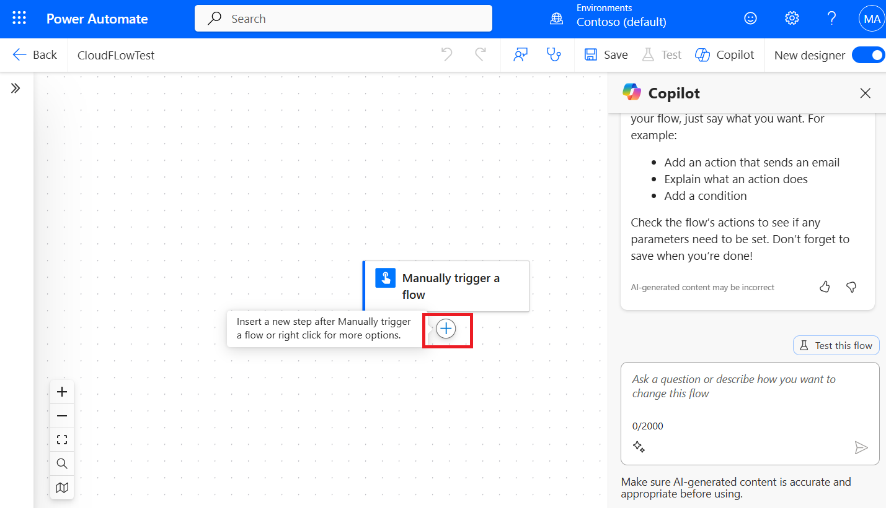

# **Lab 7: Create adaptive card for Teams**

### **Task 1: Install Workflows app in Teams** 

   **Note:** We already have installed Workflows app in Teams in the previous lab. So, you can skip this task and move forward to Taks 2.

1.  Sign into the Microsoft Teams
    using !!**https://teams.microsoft.com/**!! with
    your Office 365 tenant credentials.

     

2.  Click on **View more apps (…)** on the left navigation pane and
    search for the **Workflows** and select it.

    

### **Task 2: Add an action**

1.  Sign in to **Power Automate** using
    !!https://make.powerautomate.com/!! with your given admin tenant
    credentials.

     

2.  Select **Contoso(default)** environment from environment selector.

     

3.  Select **My flows** in the left navigation bar. Select **New
    flow** > **Instant cloud flow**.

     

4.  Name your flow as **CloudFLowTest**, select **Manually trigger a
    flow** as the trigger and click on **Create**.

     

5.  In the designer, select **New Step** and click on **Add an action**.

     

6.  On the **Add an action** page, search for **Microsoft Teams**,
    select **See more** under the **Microsoft Teams.**

     

7.  Now, select **Post an adaptive card and wait for a response** as the
    action.

     

8.  Under **Post as** field, select Flow bot, under **Post in**, select
    **Channel**.

     

9.  Select the **Team** and the **Channel** to which you'd like to post
    the card.

     Here select **Task Inspection** as team and channel as **AutomateOrg.**
    
     

10. Paste this JSON into the **Message** box.

    '''
    {
    
        "$schema": "http://adaptivecards.io/schemas/adaptive-card.json",
    
        "type": "AdaptiveCard",
    
        "version": "1.0",
    
        "body": [
    
            {
    
                "type": "TextBlock",
    
                "text": "Poll Request",
    
                "id": "Title",
    
                "spacing": "Medium",
    
                "horizontalAlignment": "Center",
    
                "size": "ExtraLarge",
    
                "weight": "Bolder",
    
                "color": "Accent"
    
            },
    
            {
    
                "type": "TextBlock",
    
                "text": "Header Tagline Text",
    
                "id": "acHeaderTagLine",
    
                "separator": true
    
            },
    
            {
    
                "type": "TextBlock",
    
                "text": "Poll Header",
    
                "weight": "Bolder",
    
                "size": "ExtraLarge",
    
                "spacing": "None",
    
                "id": "acHeader"
    
            },
    
            {
    
                "type": "TextBlock",
    
                "text": "Lorem ipsum dolor sit amet, consectetur adipiscing elit. Integer vestibulum lorem eget neque sollicitudin, quis malesuada felis ultrices. ",
    
                "id": "acInstructions",
    
    "wrap": true
    
            },
    
            {
    
                "type": "TextBlock",
    
                "text": "Poll Question",
    
                "id": "acPollQuestion"
    
            },
    
            {
    
                "type": "Input.ChoiceSet",
    
                "placeholder": "Select from these choices",
    
                "choices": [
    
                    {
    
                        "title": "Choice 1",
    
                        "value": "Choice 1"
    
                    },
    
                    {
    
                    "title": "Choice 2",
    
                    "value": "Choice 2"
    
                },
    
                    {
    
                        "title": "Choice 3",
    
                        "value": "Choice 3"
    
                    }
    
                ],
    
                "id": "acPollChoices",
    
                "style": "expanded"
    
            }
    
        ],
    
        "actions": [
    
            {
    
                "type": "Action.Submit",
    
                "title": "Submit",
    
                "id": "btnSubmit"
    
            }
    
        ]
    
    }
    '''

     

12. Make the following replacements in the JSON.

     **Important:** Do not remove any quotation marks when you do the replacements. You can revise the car choices to suit your needs:

    **Header Tagline Text**: !!Power Automate Poll!!
    
    **Poll Header**: !!Preferred Car Model!!
    
    **Poll Question**: !!Please vote on your preferred car model from the choices listed here.!!
    
    **Replace the latin text with a reason, or business context, related to why you are conducting the poll**: !!We are polling our employees in         order to determine if we should provide personalized parking places that are sized for the most popular cars.!!
    
    **Choice 1 (replace in both places**): !!Tesla!!
    
    **Choice 2 (replace in both places**): !!Lexus!!
    
    **Choice 3 (replace in both places)**: !!Honda!!

     
    
     
    
     

12. Close the **Post adaptive card and wait for a response** card.

     

13. Select **New Step**.

     

14. Search for **Send an email**  and select one of the **Send an
    email (V2)** actions under Office 365 Outlook.

     

15. When prompted **sign in** using the given admin tenant credentials.

     

16. Select **Switch to Advance mode** for **To** field.

     

17. Click on the **To** field where we enter the input and now select
    **Dynamic content icon**.

     

18. Select **body/responder/email** tag from the dynamic content.

     

19. Enter subject function as !!**acPollChoices**!! from the dynamic
    content.

     

20. Configure the **Body** of the email as follows. Replace the words in
    curly parentheses "{}" with dynamic tokens:  
    **Your poll response was {acPollChoices}** (acPollChoices is dynamic
    content from the wait for a response action). **It was submitted by
    {User Name}** (User Name is dynamic content from the trigger)

     

21. Click on **save**.

     

### **Task 3: Test your adaptive card**

1.  Click on the save button, then click on the Back button on the top
    left of the screen.

     

2.  Close the pop-up.

    

3.  On the **My flows** page, select **CloudFlowTest** click on the
    **Run** button to run the flow.

    

4.  Check that the app connection is complete. Select **Continue**.

    

5.  On the Run flow side pane click on the **Run flow** button.

    

6.  Click on **Done.**

    

7.  Now navigate back to teams page, under team select **Task Inspection
    team > AutomateOrg,** and notice Poll Request card has popped up.

    

8.  Give your vote, here we select **Tesla** and click on **Submit.**

    

    

9.  Go to your mail box to check the poll response. The email
    notification contains the body that shows who submitted the response
    and which car was selected.

    

10. Back on the Power Automate page we can Run history of flow as
    **Succeeded**.

    

11. Congratulations! you’ve just made your first interactive adaptive
    card!
