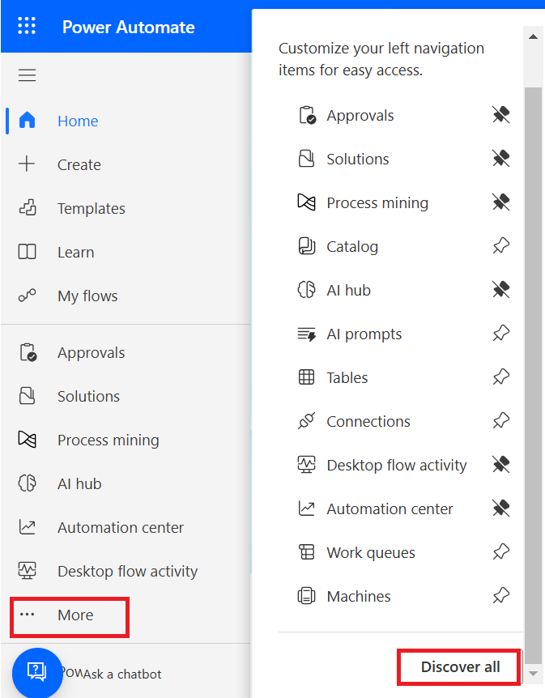
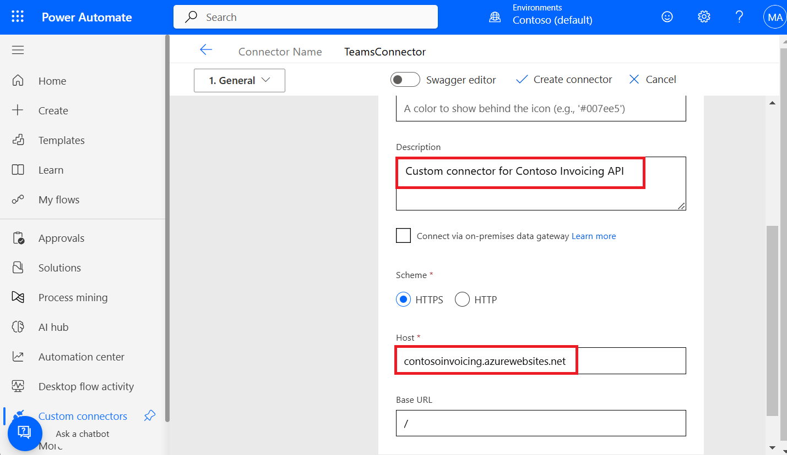
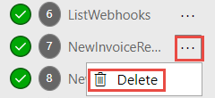
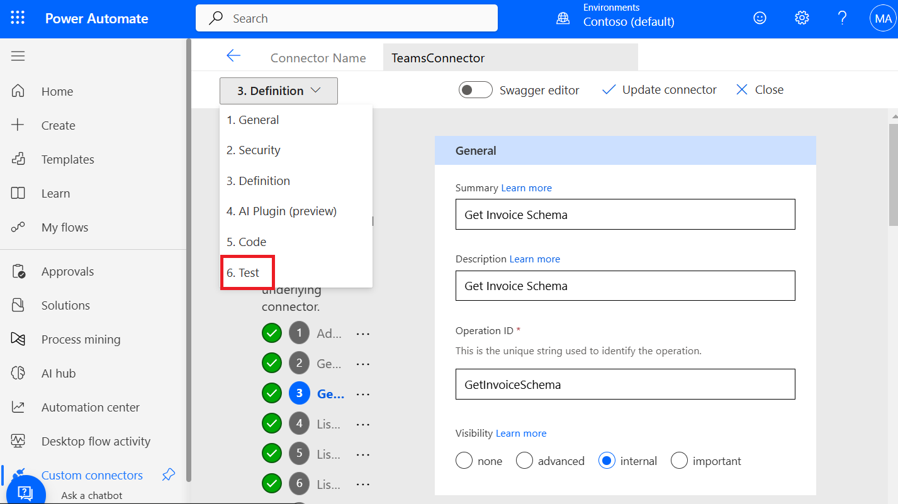
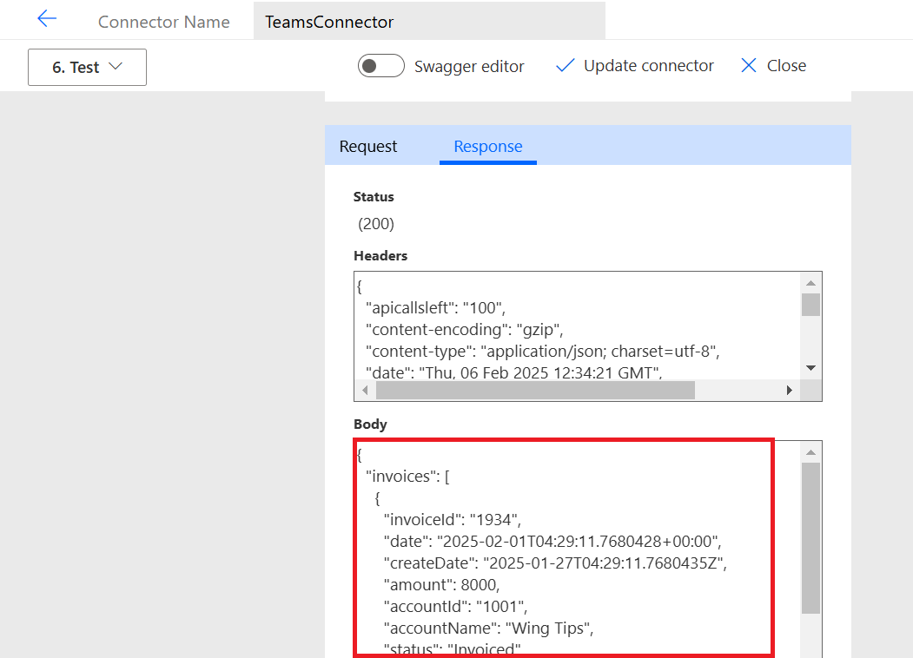
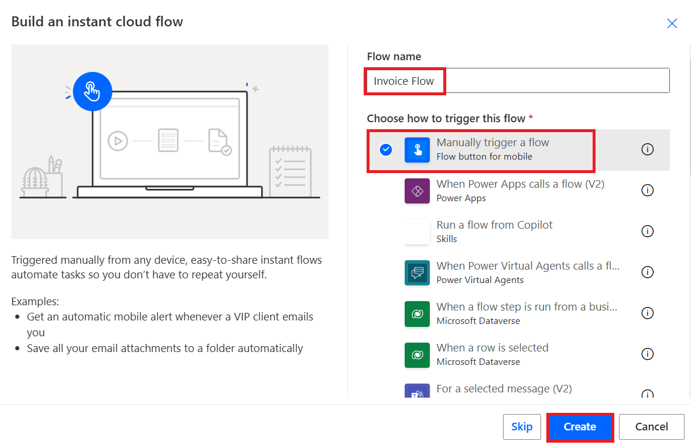
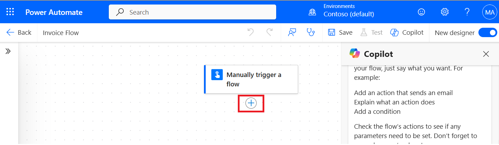
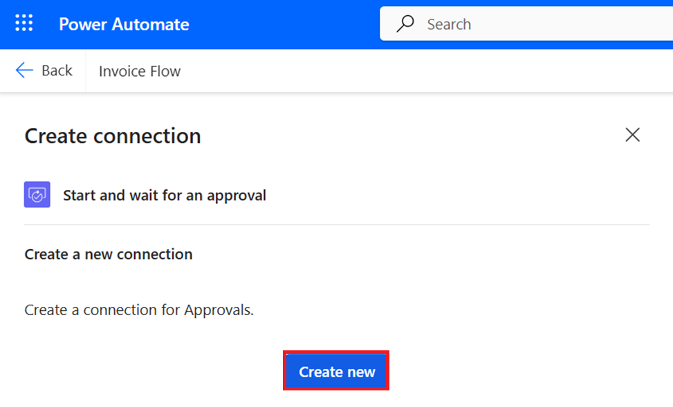
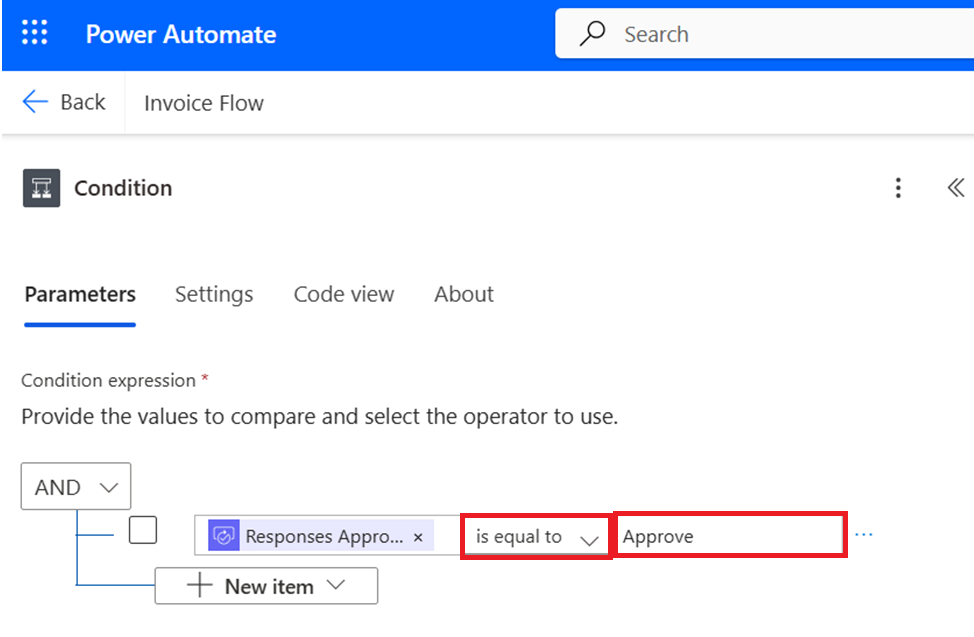
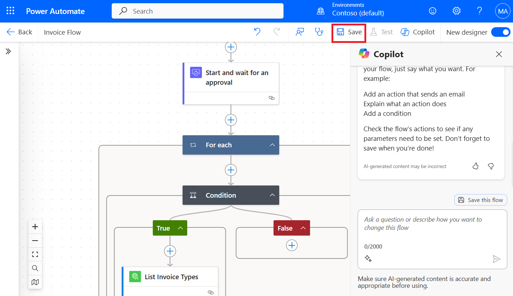

# **Lab 8: Create Microsoft Teams approval with custom connector**

### **Task 1: Setting up the API**

To review the API, follow these steps:

1.  Go to Contoso Invoicing, by navigating to the following link
    <https://contosoinvoicing.azurewebsites.net/>.

2.  To select the documentation link, click on **here** next to ‘You can
    find the API documentation’.

> 

3.  Review the available operations.

> 

4.  Close the documentation browser tab or window.

5.  Select the **Open API definition** link.

> 

6.  Copy the content from the page and save it on notepad as
    swagger.json. You'll use this file later in the exercise.

> 
>
> 

7.  Close the definition browser tab or window.

8.  Select the **API Key** link.

> 

9.  Copy and save your API key to the notepad on your VM because you'll
    need it later.

> 

### **Task 2: Create a custom connector**

1.  Sign in to Power Automate using <https://make.powerautomate.com/>
    with your given admin tenant credentials.

> 

2.  Select **Contoso(default)** environment from environment selector.

> 

3.  In the left navigation pane, click on **More,** then click on
    **Discover all.**

> 

4.  Navigate to **Data**, under Data select **Custom connectors**.

> 

5.  On the **Custom connector** page, select **New custom connector**,
    and then **Create from blank** from the dropdown list.

> 

6.  In the **Connector name** field, enter **TeamsConnector** as name
    for the custom connector, and then select **Continue**.

> 

7.  In **General Information**, enter a **Description** as **Custom
    connector for Contoso Invoicing API** and a **Host** as
    **contosoinvoicing.azurewebsites.net**.

> 

8.  Select **Create connector**.

> 

9.  Don't navigate away from this page.

### **Task 3: Import the OpenAPI definition**

To import the OpenAPI definition, follow these steps:

1.  Select the arrow next to **Connector Name**.

> 

2.  Select the ellipsis (**...**) button of the connector and then
    select **Update from OpenAPI file**.

> 

3.  Select **Import**.

> 

4.  Select the **swagger.json** file that you downloaded in **Task
    1** and then select **Open**.

> 

5.  Select **Continue**.

> 

6.  Fill in the host URL
    as !!**contosoinvoicingtest.azurewebsites.net!!** and then
    select **Security**.

> 

7.  Notice that the fields are filled out from the imported file.

> 

8.  Don't navigate away from this page.

### **Task 4: Review and adjust definitions**

To review and adjust definitions, follow these steps:

1.  Scroll down on Security page and select the **Definition** tab.

> 

2.  Take a few minutes to review the operations that were imported.

3.  Notice the blue information circle next to **GetInvoice**.

> 

4.  Select the **GetInvoice** operation.

> 

5.  Notice that the operation indicates a missing **Summary**.

> 

6.  Enter **Get Invoice** as the **Summary** to improve the usability.

> 

7.  Notice the blue information circle next to
    the **PayInvoice** operation and that it indicates a
    missing **Description**.

> 

8.  Select **PayInvoice** operation.

> 

9.  Enter **Pay an invoice** as the **Description**.

> 

10. Delete both **NewInvoice** operations because you won't use them.

> 

11. Select the **GetInvoiceSchema** operation.

> 

12. Modify the **Visibility** option to **internal** so that people
    don't see it in their action list and then select **Update
    connector**.

> 

13. Don't navigate away from this page.

### **Task 5: Test the connector**

To test the connector, follow these steps:

1.  Select the **Test** tab from the drop-down under the connector name.

> 

2.  Select **+ New connection**.

> 

3.  Paste in the **API Key** that you saved in **Task 1: Review the
    API** and then select **Create connection**.

> 

4.  Select the **Refresh** button.

> 

5.  Select **ListInvoiceTypes | Test Operation**.

> 

6.  You should see the invoice types data in the body area.

> 

7.  Select **Close** to close the custom connector window.

> 

### **Task 6: Create an approval flow**

Now that you've created your custom connector, it's time to create your
approval flow that uses the custom connector.

1.  Sign in to Power Automate using <https://make.powerautomate.com/>
    with your given admin tenant credentials.

2.  Select **New flow**, and then select **Instant cloud flow**.

> 

3.  On the **Build an automated cloud flow** screen, enter flow name as
    **Invoice Flow**, select **Manually trigger a flow** and then select
    **Create**.

> 

4.  Select **+ icon** to add new step.

> 

5.  Add an action pane will open. Select **Custom** from the **Connector
    type** dropdown.

> 

6.  Select a **TeamsConnector** custom connector.

> **Note:** To see TeamsConnector, enter in the blank space near
> connector type.
>
> 

7.  Select **List Invoices** and then close the List Invoices pane.

> 

8.  Select **+ icon** to add new step.

> 

9.  Search for "approvals", and then select **Start and wait for an
    approval**.

> 

10. This will open **Create connection** pane. Select **Create new**.

> 

11. Select the **Approval type – Approve/Reject - First to respond** ,
    enter **Approve request** as **Title**, under **Assigned to** field,
    enter ‘admin’ and then select **Mod Admin** from suggestion.
    Collapse the pane.

> 

12. Select **New step.**

> 

13. Enter ‘condition’ in the search box and select **Condition** from
    the Control action.

> 

14. Select the **Choose a value** text box and then enter responses in
    the search box and select **Responses Approver response** from the
    dynamic content.

> 

15. Update the remaining condition with the desired result as **is equal
    to** and in third field enter **Approve**.

> 

16. Select **+ icon** under the **True** condition.

> 

17. On Add an action pane, select **Custom** from **Connector type**
    dropdown.

> 

18. Select **TeamsConnector**.

> 

19. Select **List Invoice Types**.

> 

20. Select **Save** to save the flow.

> 

21. Once saving is done, select **Test** to test the flow.

> 

22. Select **Manually** and then select **Test**.

> 

23. Check that your apps (Teams Connector and Approvals) are marked as
    green tick and then select **Continue**.

> 

24. Select **Run flow**.

> 

25. Select **Done**.

> 

### **Task 7: Manage approvals generated by the approval flow**

1.  Sign in to Microsoft Teams using <https://teams.microsoft.com/> with
    your given admin tenant credentials.

2.  Select View more apps (…) from left navigation pane, search for
    the **approvals** app, and then select it.

> 

3.  View your received and sent approvals.

> 

4.  Click on **Requested** to take an action that activates your custom
    connector’s trigger.

> 

5.  Select **Approve**.

> 

6.  You can now see the status is updated as **Approved**.

> 

7.  Come back to power automate portal and you can see your flow ran
    successfully.

> 
