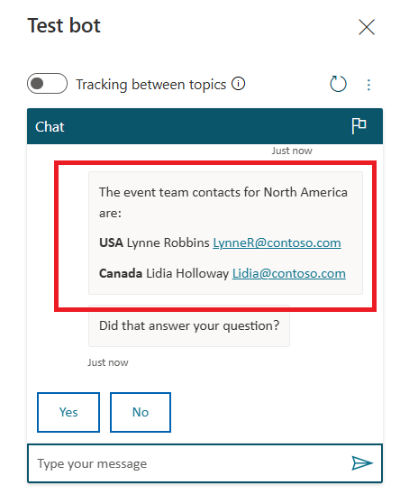

# **Lab 9: Create an agent with Microsoft Copilot Studio and Dataverse for Teams**

### **Task 1: Install Microsoft Copilot Studio for Teams and create a new agent in Teams**

1.  Open Teams Sign in to Microsoft Teams using
    !!https://teams.microsoft.com/!! with your given admin tenant
    credentials.

2.  Select **Apps** from the left navigation bar. Enter !!copilot!! in the
    search box and then select **Microsoft Copilot Studio** from the
    search results to install the Microsoft Copilot Studio app in Teams.

     

3.  Select **Add**.

     

4.  Select **Open** to open the Microsoft Copilot Studio for Teams app.

     

5.  Select **Start now.**

     

6.  Select the **Test Team** to create and manage your agent and then
    select **Continue**.

     

7.  Provide an **Agent name** - !!Event Contacts!! and keep the **Language -
    English (en-US)** for the agent to speak. Select **Create** to
    complete creating a new agent.

     
    
     

### **Task 2: Create a topic**

1.  Expand the navigation pane and select **Topics**.

     

2.  Select **+ New topic** > **From blank**.

     

3.  To name this topic or add details about it, select **Details** from
    the ribbon at the top of the screen. Name your topic !!Event
    Contacts!!.

     

4.  Select **Trigger phrases** and enter each of the following,
    press **+** after each entry and then close the Trigger phrases
    pane.

     !!who are the event contacts!!
    
     !!event contacts!!
    
     !!who to contact for the event!!
    
     !!event contact information!!
    
     !!event info!!
    
     
    
     

5.  In the **Message** node just below the **Trigger Phrases** node,
    enter the following information.

        
     !!The event team contacts for North America are:!!
  
     !!**USA** Lynne Robbins LynneR@contoso.com!!
    
     !!**Canada** Lidia Holloway Lidia@contoso.com!!
   
     

7.  Select the plus **+** symbol under the **Message** node to add
    another conversation node.

     

7.  Select **Redirect to another topic > End of Conversation**.

     

8.  Now, save your agent by selecting the **Save** button from the right
    side of the **Copilot Studio** ribbon.

     

9.  The **Test** panel is open by default on the left side of your
    authoring canvas. If you don't see it, you can select the **Test
    bot** button from the left side of the command ribbon.

     

10. In the **Test** panel, enter questions that contain one of your
    trigger phrases to observe how the agent responds. Here, you can
    enter **who are the event contacts** and click on **Send icon**.

     

11. You can see that the agent has responded to your question.

     

12. Since the agent is working for you, it can adapt other inputs as
    well. Try entering below phrase to see how it reacts (you can reset
    the test agent in between tries):

     !!contacts for the event!!
      
     

### **Task 3: Publish the agent**

1.  Select the **Publish** option from the left-side menu to go to
    the **Publish** panel.

     

2.  In the **Publish** panel for your agent, select
    the **Publish** button.

     

3.  With a popup, Copilot Studio will confirm that you want to publish
    your latest content; select **Publish** to confirm.

     

4.  The **Microsoft Teams** panel will appear on the right side of your
    screen. You can review how the agent will appear by selecting **Edit
    details**. You can change the color and/or icon, add a **short
    description** and a **Long description**, toggle whether or not you
    want your users to be able to add your agent to a team, and even
    provide developer information (under the **More** options).

     

5.  Once you're satisfied with the details of your app,
    select **Availability options** to continue.

     

6.  The **Microsoft Teams** panel provides you with a menu of options
    including - Copy link, Add to a team and Show in Teams app store.
    Select **Add to Test Team**.

     

7.  Select **Add**.

     

8.  You can see the message that **Event Contacts added to Test Team**.

     

### **Task 4: Share your agent with your organization**

1.  Under the **Show in Teams app store** select **Show to everyone in
    my org**.

     

2.  Review the requirements for submission and then select **Submit for
    admin approval**.

     

3.  Copilot Studio will ask you to confirm this action via a popup; you
    can select **Yes** to continue.

     

4.  The request is sent to the Teams admin for approval. You can check
    the request's status by opening the **Publish** option and then
    selecting **Share the bot**. 

     

5.  Go to **Microsoft Teams admin center** using
    !!https://admin.teams.microsoft.com/!!. If required, sign in with the given admin tenant credentials.

6.  Expand **Teams app**s from left navigation pane and then select
    **Manage apps**. You can see the message box of Pending approval.

     

7.  Scroll down on **Manage apps** page, under **All apps**, enter
    !!**Event**!! in search box and click on **Event Contacts** agent.

     

8.  You can see the approval request. Select **Publish**.

     

9.  Confirm your approval by selecting **Publish**.

     

10. Come back to the **Microsoft Copilot Studio for Teams** app page
    where you left earlier on the **Publish** page. Refresh the page and check that the
    status is now updated as **Published by your organization**.

     

11. After the agent has been approved, it will appear in the **Built by
    your org** section of the Teams app store for everyone in your
    organization.

     
